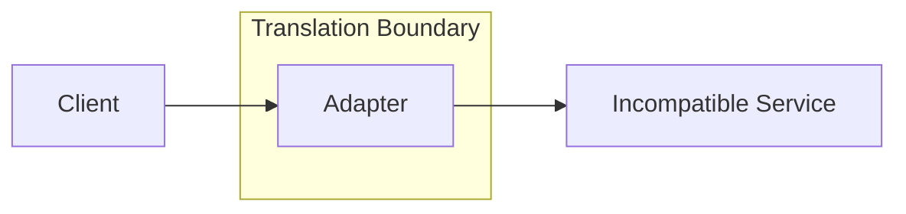

## Diagram

## Summary
Converts the interface of one component to the interface expected by another, enabling components with incompatible interfaces to work together without modifying either component. The adapter wraps the adaptee, accepting calls in the target interface's format and translating them into calls the adaptee understands — then translating the response back to the caller's expected format.

## When To Use
- Two components must collaborate but their interfaces are incompatible and neither can be modified
- Integrating a third-party library or legacy system that has an interface incompatible with the rest of the codebase
- Wrapping an existing class to give it a new interface expected by a framework or abstraction layer
- Multiple implementations with different interfaces must be substitutable behind a single consistent interface

## When To Avoid
- The interfaces are already compatible — adding an adapter introduces unnecessary indirection
- The semantic differences between the two interfaces are so deep that translation is lossy — an anticorruption layer or redesign is needed
- Performance-critical code paths cannot tolerate the overhead of adapter translation on every invocation
- Adapters proliferate throughout the codebase as a workaround for poor interface design — fix the underlying design instead

## Pros and Cons

* Good, because enables reuse of existing components without modifying them, preserving encapsulation
* Good, because new implementations can be introduced by adding an adapter rather than modifying existing call sites
* Good, because the adapter is isolated in one class — interface translation logic is not scattered throughout the codebase
* Bad, because adds a layer of indirection that increases the number of classes and can obscure the call chain
* Bad, because if many adapters are needed, it is a signal that the architecture has fundamental interface design issues
* Bad, because complex two-way translation between very different interfaces makes adapters hard to test and maintain

## Evolutions
- **From:** Proxy (Adapter is a proxy focused specifically on interface translation between incompatible components)
- **To:** Anticorruption Layer (add semantic domain translation on top of interface adaptation), Facade (simplify multiple adapters into a single cohesive interface)
