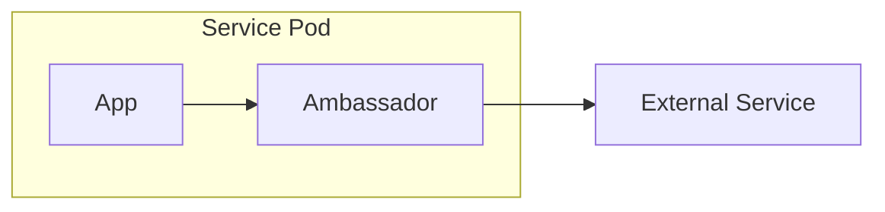

## Diagram

## Summary
A specialized sidecar that acts as an outbound proxy for a service, handling all egress calls on that service's behalf. The ambassador manages retries, circuit breaking, timeouts, and protocol translation for all outbound requests — the application simply calls the ambassador on localhost and the ambassador handles the complexities of calling remote services reliably.

## When To Use
- A service makes outbound calls and needs resilience features (retries, timeouts, circuit breaking) without embedding them in application code
- Protocol translation or connection pooling is needed between the service and its downstream dependencies
- The same outbound resilience patterns must be applied consistently across many services written in different languages
- You want to offload monitoring and tracing of outbound traffic to a dedicated component

## When To Avoid
- The service has very few outbound dependencies and inline resilience code is simpler
- A full service mesh is already deployed — the mesh sidecars already handle outbound traffic management
- The ambassador's latency overhead is unacceptable for latency-sensitive call paths
- The team cannot operate per-instance sidecar deployments in their infrastructure

## Pros and Cons

* Good, because outbound resilience logic (retries, circuit breaking, timeouts) is centralized and language-agnostic
* Good, because the application code is simplified — it calls localhost without worrying about remote service failures
* Good, because the ambassador can be updated independently to change resilience policies without redeploying the application
* Bad, because adds a network hop and latency to every outbound call
* Bad, because introduces an additional process that must be deployed, monitored, and maintained alongside every service instance
* Bad, because ambassador configuration must be kept in sync with the actual downstream service topology

## Evolutions
- **From:** Sidecar (specialize a generic sidecar to focus exclusively on outbound traffic management)
- **To:** Service Mesh (extend the ambassador pattern across all services with a unified control plane)
