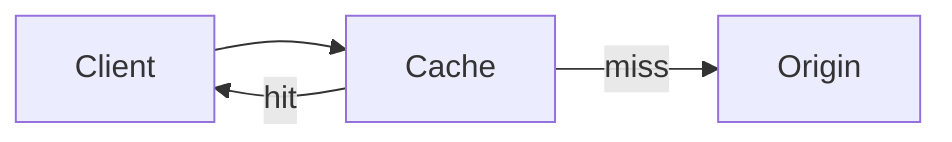

## Diagram

## Summary
A proxy that intercepts requests destined for a backend service and serves responses from a local cache when a valid cached entry exists. On a cache miss, it forwards the request to the backend, stores the response, and returns it to the caller. Reduces backend load, improves response times for repeated requests, and can absorb traffic spikes for read-heavy workloads.

## When To Use
- Backend services receive many repeated requests for the same data that changes infrequently
- Response latency must be reduced and the data can tolerate bounded staleness
- Backend services are expensive to call (CPU-intensive, third-party rate-limited, or database-backed) and caching amortizes that cost
- A read-heavy workload creates load that the backend cannot handle without horizontal scaling

## When To Avoid
- Data changes frequently and even brief cache staleness would result in incorrect behavior
- Each request is unique or personalized such that cache hit rates would be negligible
- Cache invalidation logic is complex enough that the correctness risks outweigh the performance gains
- Sensitive data must never be stored in intermediate caches due to privacy or compliance requirements

## Pros and Cons

* Good, because dramatically reduces backend load for read-heavy workloads by serving repeated requests from cache
* Good, because response times improve for cached entries — data is served without a round-trip to the backend
* Good, because absorbs traffic spikes for cacheable content, protecting downstream services
* Bad, because stale data in the cache can cause clients to receive outdated responses until the cache entry expires
* Bad, because cache invalidation logic is notoriously difficult to get right — incorrect invalidation causes bugs or stale reads
* Bad, because cache size and eviction policy must be tuned carefully or the cache either wastes memory or has low hit rates

## Evolutions
- **From:** Proxy (Caching Layer is a proxy specialized to add response storage and replay)
- **To:** CDN / Edge Service (push cache closer to users at the network edge), Distributed Cache (share cache state across multiple service instances)
