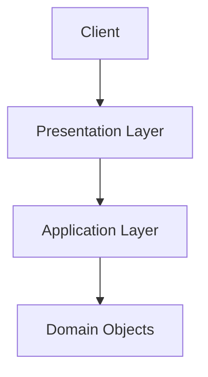

## Diagram

## Summary
The component responsible for rendering data for users or external consumers in the format they require — HTML for browsers, JSON for API clients, XML for legacy integrations. The presentation layer translates between domain or application data and the representation format required by the consumer, keeping rendering concerns out of the domain model and business logic.

## When To Use
- Different consumers require the same underlying data in different formats or representations
- Rendering and formatting logic must be isolated so that domain logic does not become entangled with display concerns
- The same business data needs to be presented differently for web, mobile, and API consumers
- Consumer-facing contracts must be able to evolve independently from the domain model

## When To Avoid
- The system has no user-facing output and all output is machine-to-machine — the layer adds no value
- The presentation transformation is trivially simple and adding a dedicated layer creates unnecessary ceremony
- The presentation layer accumulates business logic that should live in the domain — it becomes a leaky abstraction
- Performance-critical rendering (e.g., game engines, real-time graphics) requires a specialized approach beyond a generic layer

## Pros and Cons

* Good, because domain logic and presentation logic are separated — each can change independently
* Good, because multiple presentation formats can be supported from the same underlying data without duplicating business logic
* Good, because the presentation layer is the natural place to apply consumer-specific access control and data masking
* Bad, because adds a layer of indirection that can obscure data flow and increase the number of components to maintain
* Bad, because presentation layers often accumulate business logic over time, eroding the separation of concerns
* Bad, because tight coupling between the presentation layer and domain objects can make the domain model hard to change

## Evolutions
- **From:** Proxy (Presentation Layer is a proxy between the domain model and consumer-facing output formats)
- **To:** Backends for Frontends (create dedicated presentation layers per client type), GraphQL Layer (consumer-driven query of the presentation layer), Server-Side Rendering (move rendering to the server for performance)
