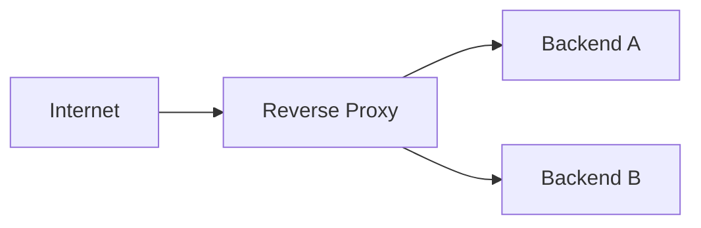

## Diagram

## Summary
A proxy that sits in front of one or more backend servers and forwards client requests to them. Clients interact with the reverse proxy as if it were the server — backend server topology is hidden from clients. The reverse proxy handles SSL/TLS termination, optionally performs load balancing, compression, or caching, and provides a single stable entry point that can route to any backend server.

## When To Use
- Backend server topology must be hidden from external clients (IP addresses, server count, internal hostnames)
- SSL/TLS termination should be offloaded from application servers to a dedicated proxy
- Multiple backend applications must be served from a single IP address or domain using path-based routing
- Static content caching, compression, or connection pooling should be handled at the infrastructure level

## When To Avoid
- A single backend service is exposed directly and the additional hop adds no value
- Application-layer concerns (auth, rate limiting, transformation) are required — an API Gateway is more appropriate
- The reverse proxy would introduce a single point of failure without a high-availability configuration
- Deep packet inspection or application protocol awareness is needed beyond basic HTTP/TCP forwarding

## Pros and Cons

* Good, because hides backend topology — servers can be replaced, added, or reconfigured without clients noticing
* Good, because SSL/TLS termination at the proxy offloads cryptographic overhead from application servers
* Good, because static asset caching and compression at the proxy reduce backend load and bandwidth
* Bad, because the proxy is a new infrastructure component that must be deployed, configured, and monitored
* Bad, because adds a network hop to every request, introducing latency and a potential failure point
* Bad, because without high-availability configuration, the reverse proxy becomes a single point of failure

## Evolutions
- **From:** Proxy (Reverse Proxy is a server-side proxy that shields backend topology from clients)
- **To:** Load Balancer (add distribution across a pool of backends), API Gateway (add application-layer cross-cutting concerns), Edge Service (push the proxy to the CDN edge)
