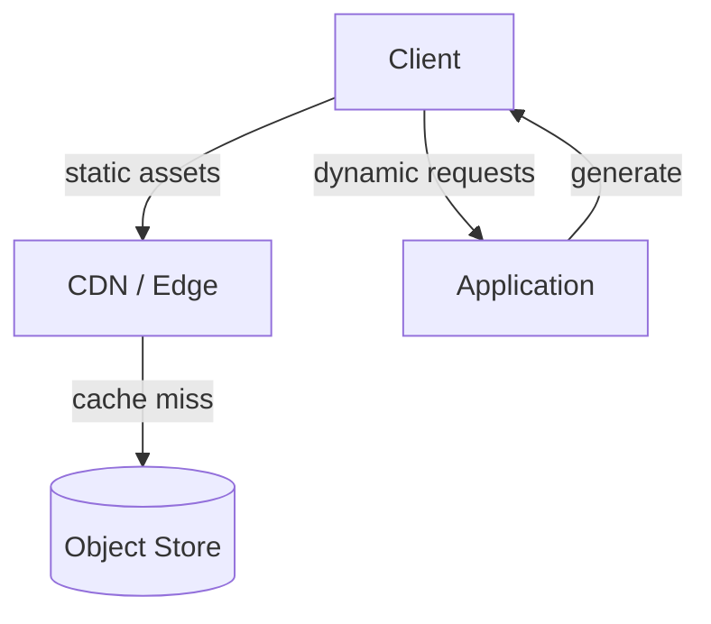

## Diagram

## Summary

Serves static assets — images, scripts, stylesheets, downloads — directly from a storage service or CDN edge instead of routing them through the application. The application handles only dynamic requests; static content is delivered from a location optimized for high-throughput, low-latency delivery close to the user. This offloads bandwidth and connection load from application servers, reduces latency via edge caching, and lets each tier scale according to its own workload.

## When To Use

- A significant share of traffic is static assets that do not need application logic to serve
- Users are geographically distributed and would benefit from edge-cached delivery
- Application servers are spending capacity serving files instead of generating dynamic responses

## When To Avoid

- Content is highly dynamic or personalized per request and cannot be cached at the edge
- Assets require per-request authorization the CDN cannot enforce (though signed URLs / Valet Key can bridge this)
- The volume of static content is trivial and a separate hosting tier adds needless moving parts

## Pros and Cons

* Good, because application servers are freed from serving files, reserving their capacity for dynamic work
* Good, because edge caching delivers assets from near the user, lowering latency and origin bandwidth
* Bad, because cache invalidation and content versioning must be managed — stale assets are a common failure mode
* Bad, because access control on static content is weaker at the edge — protecting private assets needs signed URLs or tokens

## Evolutions

- **From:** The application serving all content, static and dynamic, from its own servers
- **To:** Combine with a Caching Layer for dynamic responses; use Valet Key / signed URLs when static assets must remain access-controlled
