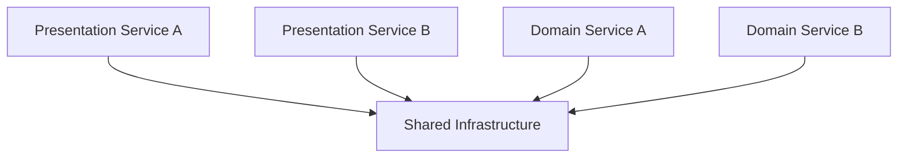

## Diagram

## Summary
A fragmented metapattern where a shared infrastructure layer sits between two service layers — one on top (presentation or API services) and one on the bottom (data or domain services). The infrastructure middle layer provides common capabilities such as messaging, caching, or a shared database that both outer layers depend on. The structure resembles a sandwich: top services, shared infrastructure filling, bottom services.

## When To Use
- Multiple presentation or API services need to share the same backend data or infrastructure without duplicating it
- A clear horizontal separation between delivery concerns (top) and domain/data concerns (bottom) adds clarity
- Infrastructure capabilities (caching, messaging, storage) are stable and can serve as a reliable shared contract between layers
- Scaling the middle infrastructure layer independently from either service layer is operationally desirable

## When To Avoid
- The shared middle layer becomes a bottleneck or a deployment dependency blocking all services above and below it
- Services in the top and bottom layers need to evolve independently but are coupled through the shared infrastructure schema or API
- The pattern encourages teams to embed business logic in the shared infrastructure layer, creating a distributed monolith
- The organization's team topology does not map to horizontal layers — vertical slices per domain may be more appropriate

## Pros and Cons

* Good, because shared infrastructure is consolidated — no duplication of databases, caches, or buses across services
* Good, because the architecture is easy to reason about — each layer has a clear responsibility
* Good, because the middle layer can be scaled, upgraded, or replaced without touching business logic in the outer layers
* Bad, because the shared middle layer introduces coupling — any change to its interface affects both top and bottom services
* Bad, because the infrastructure layer can accumulate logic it should not own, becoming a hidden orchestrator
* Bad, because cross-layer deployments require careful coordination, slowing down independent release cadences

## Evolutions
- **From:** Monolith or simple two-tier architecture (introduce shared infrastructure as services are extracted)
- **To:** Microservices with vertically owned data (each service owns its own persistence), Event-driven architecture (replace shared infrastructure with async messaging), Service Mesh (offload cross-cutting infrastructure concerns to a sidecar layer)
