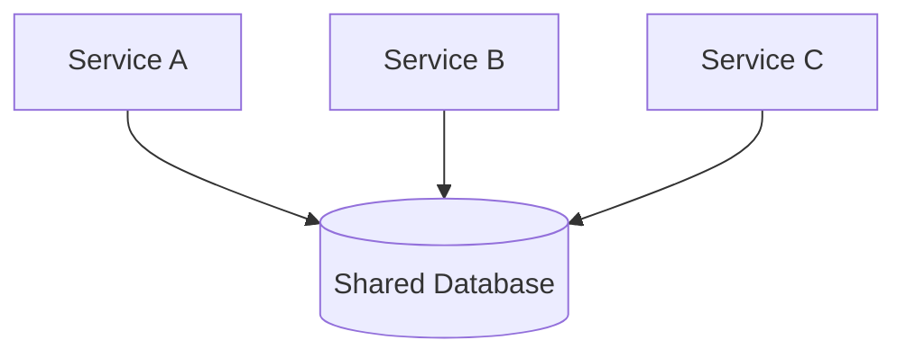

## Diagram

## Summary
A single shared datastore that multiple services read from and write to directly. Services integrate at the data layer rather than through APIs or messaging. The repository serves as the implicit contract between services — any service that needs data reads it directly, and any service that produces data writes it directly.

## When To Use
- Multiple services legitimately share data and the overhead of API calls or messaging is not justified
- Strong consistency is required across services and distributed transactions would be too complex
- The team is small and operational simplicity outweighs the coupling risk
- Migrating a monolith incrementally — a shared database is an acceptable transitional step before full service decomposition

## When To Avoid
- Services need to evolve their data models independently — schema changes break all consumers simultaneously
- Different services have different scaling, availability, or durability requirements for their data
- The organization has independent teams that own separate services — shared schema creates organizational coupling
- Data access patterns differ enough that a single database technology cannot serve all services well

## Pros and Cons

* Good, because data consistency is trivial — all services see the same data with standard ACID semantics
* Good, because no need for synchronization protocols, event buses, or API contracts between services
* Good, because operationally simple — one database to back up, monitor, and tune
* Bad, because schema changes are breaking changes for every service — impedes independent deployment
* Bad, because services become tightly coupled at the data layer, undermining the isolation microservices promise
* Bad, because a single database is a scaling and availability bottleneck when services have divergent load patterns

## Evolutions
- **From:** Monolith (extract services but initially retain the shared database as a stepping stone)
- **To:** Middleware (replace shared data with asynchronous messaging), Service-owned databases with APIs (full decomposition), Persistent Event Log (shared read model via event sourcing)
