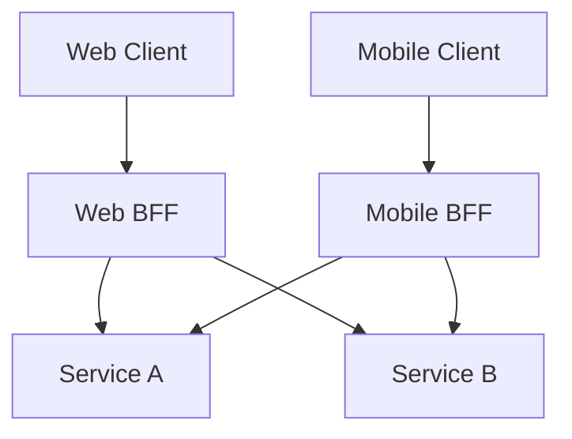

## Diagram

## Summary
Backends for Frontends (BFF) is a pattern in which a dedicated backend service is created per client type — typically one for web, one for mobile, one for TV or other devices — rather than exposing a single general-purpose API to all clients. Each BFF aggregates and tailors data from downstream services to the specific needs, data shapes, and interaction patterns of its target client. This avoids the over-fetching and under-fetching that arises when a single API must serve the lowest common denominator of all clients.

## When To Use
- Different client types (web, mobile, IoT, TV) have significantly different data requirements, payload sizes, or interaction patterns
- Mobile clients need bandwidth-optimized responses while web clients need richer data
- Client teams want autonomy to evolve their own API contracts without coordinating with all other client teams
- Downstream services expose coarse-grained APIs that need aggregation and transformation before reaching clients

## When To Avoid
- All clients have nearly identical data requirements — a shared API gateway suffices
- The team is too small to maintain multiple backend services in parallel
- Client types are few and simple enough that a single API with optional fields handles the variation
- The overhead of deploying and operating multiple BFFs outweighs the benefit of per-client optimization

## Pros and Cons

* Good, because each BFF is optimized for exactly one client's needs, reducing over-fetching and under-fetching
* Good, because client teams can evolve their BFF contracts independently without coordinating across all client types
* Good, because security and authorization logic can be tailored per client (e.g. stricter token requirements for web vs. mobile)
* Bad, because code duplication arises when BFFs share similar aggregation or transformation logic across client variants
* Bad, because operational overhead increases — each BFF is a separate service to deploy, monitor, and scale
* Bad, because organizational overhead grows if client teams own their BFFs but must still coordinate on shared downstream service changes

## Evolutions
- **From:** Single API Gateway (introduce per-client BFFs when one gateway can no longer satisfy all clients without coupling)
- **To:** GraphQL (replace multiple BFFs with a single flexible query layer that each client queries for exactly what it needs)
