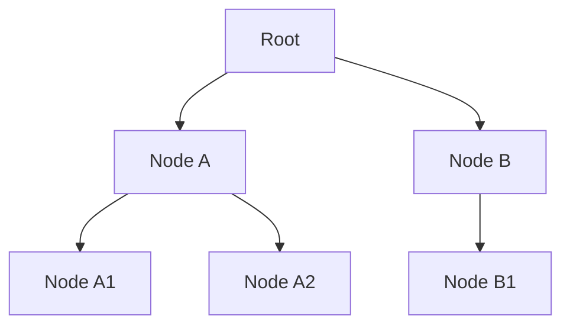

## Diagram

## Summary
Hierarchy is a metapattern in which services are organized into a strict hierarchy of levels — upper layers delegate work to lower layers, and lower layers never call upward. Each level abstracts the implementation details of the level below it, exposing a cleaner interface to the level above. This one-directional dependency flow prevents circular dependencies, makes the system easier to reason about, and allows lower levels to be replaced or evolved without affecting callers above the change boundary.

## When To Use
- The system has clear levels of abstraction (e.g. orchestration → domain services → data access) that benefit from enforced dependency direction
- Preventing circular dependencies across service boundaries is a design priority
- Lower-level services are shared utilities (storage, identity, notification) consumed by many higher-level services
- Teams want to enforce a strict separation between business orchestration logic and infrastructure concerns

## When To Avoid
- Services have naturally peer-to-peer relationships where no clear hierarchy exists
- Strict hierarchy forces awkward indirection when two services at the same level need to collaborate
- Event-driven or choreography-based architectures where no central orchestrator sits "above" domain services
- The hierarchy introduces unnecessary call hops that degrade latency without adding abstraction value

## Pros and Cons

* Good, because one-directional dependencies eliminate circular dependency risks across services
* Good, because each level hides implementation details from the level above, enabling independent evolution of lower layers
* Good, because lower-level services become reusable utilities shared across many higher-level consumers
* Bad, because strict hierarchy can require call chains to pass through multiple layers even for simple operations, adding latency
* Bad, because peer-level collaboration requires routing through a higher-level orchestrator, which can be awkward and inefficient
* Bad, because identifying the correct level for a new service is a non-trivial design decision that teams often disagree on

## Evolutions
- **From:** Unstructured Service Mesh (impose hierarchy to eliminate circular dependencies and clarify ownership)
- **To:** Cell-Based Architecture (group hierarchical services into autonomous cells with their own control planes)
