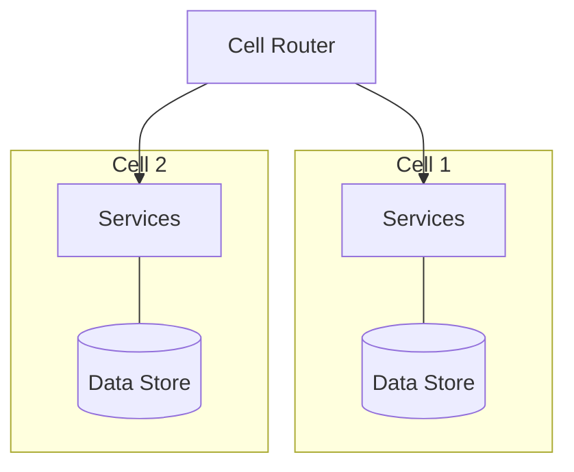

## Diagram

## Summary
Cell-Based Architecture organizes services into self-contained, independently deployable cells. Each cell is a complete, bounded slice of the system — containing its own set of services, data stores, and control plane — capable of serving a defined subset of users or requests without depending on other cells. A cell router (or routing tier) sits above all cells and directs incoming traffic to the appropriate cell based on routing keys such as tenant ID, user ID, or geographic region. Because cells share no state with one another, failures, overloads, or deployments in one cell do not affect others.

## When To Use
- Fault isolation is a critical requirement and blast radius of failures must be bounded to a subset of users
- Multi-tenant SaaS systems need to ensure one tenant's load or failures do not impact others
- Large-scale deployments require incremental rollouts — new versions can be deployed to individual cells before broader rollout
- Geographic data residency requirements mandate that certain users' data and processing stay within specific regions

## When To Avoid
- The system is small enough that the overhead of cell management, routing, and per-cell infrastructure is not justified
- Workloads are not easily partitioned — requests require cross-cell data or coordination, negating isolation benefits
- The team lacks the operational tooling to manage cell lifecycle, routing configuration, and cross-cell observability
- Low-latency requirements conflict with the additional routing hop a cell router introduces

## Pros and Cons

* Good, because failures are isolated to a single cell — the blast radius of any incident is bounded to that cell's users
* Good, because cells can be deployed, scaled, and upgraded independently, enabling safe incremental rollouts
* Good, because cells scale horizontally — adding capacity means adding cells rather than scaling a monolithic cluster
* Bad, because per-cell infrastructure (databases, services, routing rules) multiplies infrastructure cost and operational complexity
* Bad, because requests requiring data from multiple cells are complex to handle and may require cross-cell coordination
* Bad, because the cell router itself becomes a critical component whose failure affects all cells and must be designed for high availability

## Evolutions
- **From:** Hierarchy (apply cell boundaries to group hierarchical services into autonomous, isolated units)
- **To:** Multi-Region Active-Active (extend cell isolation across geographic regions for disaster recovery and latency optimization)
