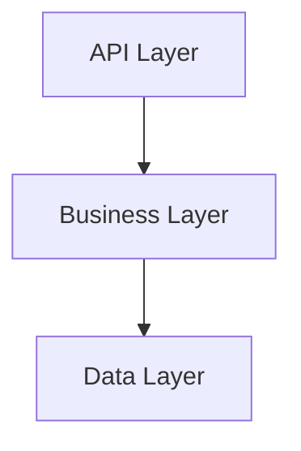

## Diagram

## Summary
Layered Services combines the Layers and Services metapatterns — the system is decomposed into independent services, and each service is internally structured into horizontal layers (e.g. presentation, application, domain, infrastructure). This dual decomposition enforces separation of concerns at both the macro (inter-service) and micro (intra-service) levels, yielding systems that are independently deployable yet internally coherent.

## When To Use
- Teams need to own and deploy services independently while maintaining internal code discipline
- Domain complexity within individual services warrants layered structure to separate business logic from infrastructure concerns
- The system is large enough that both service boundaries and intra-service layering provide meaningful organizational value
- Onboarding new developers benefits from a predictable internal structure shared across services

## When To Avoid
- The system is small enough that a single layered application suffices
- Teams lack the maturity to maintain layer discipline across many services simultaneously
- Service granularity is so fine that internal layering adds ceremony without value
- Rapid prototyping phases where structure slows exploration

## Pros and Cons

* Good, because services are independently deployable and scalable
* Good, because internal layering keeps domain logic decoupled from infrastructure concerns within each service
* Good, because predictable structure reduces cognitive overhead when navigating unfamiliar services
* Bad, because dual decomposition (services + layers) increases the total codebase surface area and operational overhead
* Bad, because enforcing layer boundaries consistently across many services requires team discipline and tooling
* Bad, because over-decomposition into too many fine-grained services negates the clarity that internal layering provides

## Evolutions
- **From:** Monolithic Layered Architecture (extract services from a layered monolith while preserving internal layer structure)
- **To:** CQRS (split the service layer into command and query paths), Hexagonal Architecture (replace layering with ports-and-adapters within each service)
