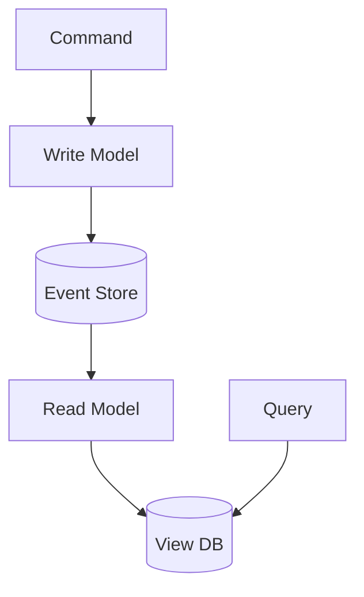

## Diagram

## Summary
Separates the write model (commands that mutate state) from the read model (queries that return data) into distinct components, code paths, and optionally datastores. The write side enforces invariants; the read side is optimized independently for query performance.

## When To Use
- Read and write workloads have significantly different scaling or performance characteristics
- Multiple distinct read models serve different clients (dashboards, APIs, reports)
- Domain logic on the write side should be isolated from query optimization concerns
- Event Sourcing is in use and read models are projections of the event stream

## When To Avoid
- The domain is simple CRUD — two models add complexity with no benefit
- The team is unfamiliar with eventual consistency between write and read sides
- Real-time consistency between reads and writes is a hard requirement
- The codebase is small enough that a single model is maintainable

## Pros and Cons

* Good, because write and read models scale and optimize independently
* Good, because the write model stays clean — no query concerns pollute domain logic
* Good, because multiple read models can serve different clients from the same source
* Bad, because eventual consistency between write and read sides requires explicit handling
* Bad, because significantly more code and infrastructure than a unified model
* Bad, because queries may return stale data — requires careful UX and API contract design

## Evolutions
- **From:** Layered Services (CQRS splits the service layer into distinct command and query paths)
- **To:** Event Sourcing (use events as the source of truth for read projections), CQRS View Database (specialized read store for projections)
