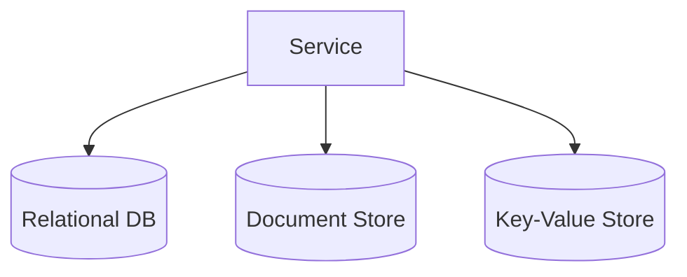

## Diagram

## Summary
Polyglot Persistence is an architectural approach in which different data stores are used for different parts of the system, each chosen for its fit with the data shape and access patterns of that component. A relational database may handle transactions and referential integrity, a document store may hold flexible schemas, a graph database may manage relationship traversal, a key-value cache may serve hot reads, and a time-series store may ingest metrics — all within the same system. The result is that each service or component uses the storage engine best matched to its requirements rather than forcing all data into a single general-purpose database.

## When To Use
- Different parts of the system have fundamentally different data shapes, access patterns, or consistency requirements
- Scaling a single general-purpose database would be prohibitively expensive compared to purpose-fit stores
- Read-heavy components benefit from dedicated caches or read replicas without affecting transactional stores
- Event-driven designs where an append-only event log serves as the source of truth alongside derived read stores

## When To Avoid
- The team lacks the operational expertise to run and maintain multiple database technologies
- Data relationships are tightly coupled across domains, making cross-store joins or transactions complex
- The system is simple enough that a single well-tuned general-purpose database meets all needs
- Organizational policies or compliance requirements mandate a single approved datastore

## Pros and Cons

* Good, because each component uses the storage engine best suited to its data shape and access patterns
* Good, because scaling is targeted — only the stores under load need to scale, not the entire database tier
* Good, because purpose-fit stores often outperform a general-purpose database for their specific workload
* Bad, because operational complexity multiplies — each store requires its own backup, monitoring, and expertise
* Bad, because cross-store transactions and consistency are difficult; distributed sagas or eventual consistency must be accepted
* Bad, because data duplication across stores increases the risk of inconsistency if synchronization logic fails

## Evolutions
- **From:** Single-Database Architecture (introduce additional stores incrementally as access pattern mismatches become bottlenecks)
- **To:** CQRS View Database (maintain a dedicated read store as a projection of the write store), Data Lake (centralize raw data from all stores for analytics)
