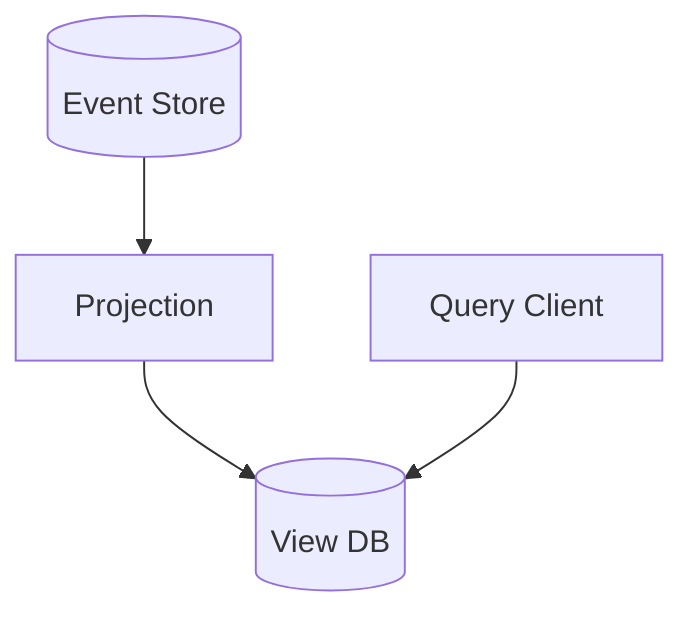

## Diagram

## Summary
A CQRS View Database is a dedicated read-optimized datastore (or schema) maintained as a projection of the command-side's events or state changes. It is updated asynchronously as events flow from the write side and is structured specifically to serve the query patterns of one or more consumers. Unlike a general-purpose read replica, the view database may denormalize, aggregate, or reshape data into a form that makes reads trivially fast with no joins required.

## When To Use
- CQRS is in use and read queries are complex enough that serving them from the write model's store requires expensive joins or aggregations
- Different consumers need different shapes of the same data — multiple view databases can serve each independently
- Event Sourcing is in use and current-state queries must be answered without replaying the full event history
- Query performance requirements cannot be met by the normalized write-side schema

## When To Avoid
- The domain is simple enough that reading from the write store directly is acceptable
- Eventual consistency between the write side and the view is unacceptable for the use case
- The overhead of maintaining projection logic and a separate store outweighs the query performance benefit
- A standard read replica of the write database provides sufficient query performance

## Pros and Cons

* Good, because the view is tailored exactly to consumer query patterns — reads are fast with no joins
* Good, because the view store's technology can be chosen independently (e.g. Elasticsearch for full-text, Redis for low-latency)
* Good, because multiple views can coexist, each optimized for a different consumer without impacting others
* Bad, because view data is eventually consistent with the write side — consumers must tolerate stale reads
* Bad, because projection logic must be written and maintained for every view, adding significant code surface area
* Bad, because if a view becomes corrupted or out of sync, replaying events to rebuild it may be time-consuming

## Evolutions
- **From:** CQRS (introduce a view database when serving read queries from the write store becomes a bottleneck)
- **To:** Materialized View (generalize the concept to any pre-computed query result, not only in CQRS contexts)
