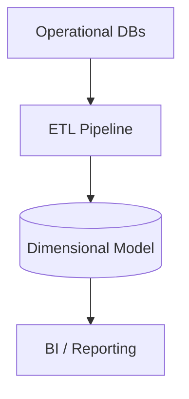

## Diagram

## Summary
A Data Warehouse is a central repository of integrated data from multiple operational sources, optimized for analytical queries (OLAP). Data is extracted from source systems, transformed into a consistent structure, and loaded via ETL pipelines into a schema-on-write model (typically star or snowflake schema). The warehouse is read-optimized for complex aggregations across large datasets and serves business intelligence, reporting, and decision-support workloads.

## When To Use
- Business intelligence and reporting workloads require complex aggregations across large volumes of historical data
- Data from multiple operational systems (CRM, ERP, transactional DBs) must be integrated into a consistent, queryable structure
- Analysts need a stable, governed schema that separates analytical queries from operational system load
- Compliance or business requirements mandate long-term retention and historical trend analysis

## When To Avoid
- Raw or unstructured data needs to be stored before a schema is defined — use a Data Lake instead
- Real-time or near-real-time analytics are required and ETL latency is unacceptable
- Data sources are so homogeneous that a single operational database serves both transactional and analytical needs
- The volume of data is too small to justify the ETL pipeline and warehousing infrastructure costs

## Pros and Cons

* Good, because analytical queries run against pre-transformed, consistently structured data optimized for aggregation
* Good, because operational systems are shielded from expensive analytical query load
* Good, because a governed, integrated schema enables consistent reporting across the organization
* Bad, because ETL pipelines introduce latency — the warehouse typically reflects a snapshot from hours or days ago
* Bad, because schema changes require ETL pipeline updates, making evolution of the warehouse schema expensive
* Bad, because a rigid schema-on-write model cannot accommodate raw, exploratory, or unstructured analytical use cases

## Evolutions
- **From:** Operational Databases (introduce a warehouse when analytical workloads degrade transactional system performance)
- **To:** Data Lake (complement with a lake for raw data storage and exploratory analytics), Data Lakehouse (unify warehouse structure with lake flexibility in a single platform)
