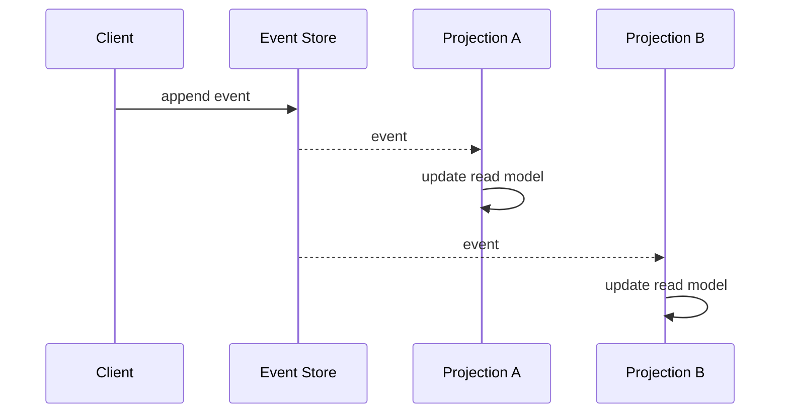

## Diagram

## Summary
State is derived by replaying an append-only sequence of domain events rather than storing the current state directly. The event log is the authoritative source of truth; the current state of any entity is a projection computed by folding over its event history. Events are immutable facts about what happened (e.g. `OrderPlaced`, `PaymentReceived`) and are never updated or deleted, providing a complete audit trail and enabling temporal queries.

## When To Use
- A complete audit trail of all state changes is a regulatory or business requirement
- The ability to reconstruct past states or replay history to derive new projections is valuable
- CQRS is in use and read models are projections derived from the event stream
- Debugging and root-cause analysis benefit from a full, ordered history of domain events

## When To Avoid
- The domain has no meaningful history — only the current state matters and audit is not required
- The team is unfamiliar with event-driven design; the conceptual shift is significant
- Entities have very high event rates, making full-replay impractical without snapshotting
- Simple CRUD applications where the overhead of event modeling outweighs the benefits

## Pros and Cons

* Good, because the event log provides a complete, immutable audit trail of all domain state changes
* Good, because new read projections can be built at any time by replaying the existing event history
* Good, because events are a natural integration boundary — other services can subscribe and react asynchronously
* Bad, because querying current state requires replaying events or maintaining projections, adding complexity
* Bad, because schema evolution of past events is difficult — old events cannot be changed and consumers must handle multiple versions
* Bad, because event stores grow indefinitely; snapshots must be managed to keep replay times acceptable

## Evolutions
- **From:** Mutable State Database (adopt event sourcing to gain audit history and projection flexibility)
- **To:** CQRS (pair with separate read models built from event projections), CQRS View Database (materialize projections into a dedicated read store)
