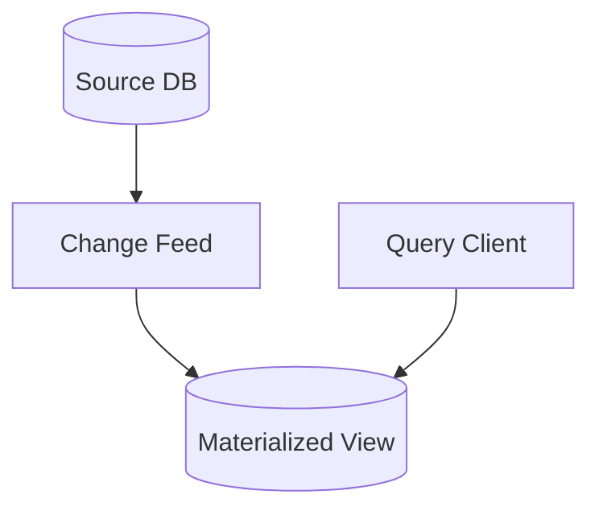

## Diagram

## Summary
A Materialized View is a pre-computed, stored query result that is refreshed when the underlying source data changes. Rather than recomputing an expensive query (involving joins, aggregations, or window functions) at read time, the result is computed eagerly and persisted. The view trades some degree of freshness for substantially faster read performance and reduced compute cost at query time.

## When To Use
- Queries are expensive to compute (multi-table joins, large aggregations) and are executed frequently
- Read latency requirements cannot be met by running the full query on demand
- The underlying data changes at a lower frequency than the query is executed, making refresh overhead acceptable
- Multiple consumers need the same pre-aggregated or joined result and should not each recompute it independently

## When To Avoid
- Source data changes at very high frequency, making the view perpetually stale or the refresh overhead prohibitive
- Strict real-time consistency is required — any staleness between the view and source is unacceptable
- The query is simple enough that on-demand execution meets performance requirements without pre-computation
- Storage costs for the materialized result are significant relative to the query savings

## Pros and Cons

* Good, because read latency is dramatically reduced — queries read a pre-computed result instead of executing expensive operations live
* Good, because compute load on the primary store is reduced by offloading repeated aggregation to the refresh process
* Good, because the view can be indexed and optimized independently of the underlying tables
* Bad, because the view may serve stale data between refreshes — the staleness window must be acceptable to consumers
* Bad, because refresh logic adds complexity, particularly for incremental updates vs. full recomputation
* Bad, because storage overhead accumulates for large pre-computed datasets, especially when multiple views exist

## Evolutions
- **From:** On-Demand Query Execution (introduce materialized views when repeated expensive queries degrade performance)
- **To:** CQRS View Database (apply the same concept within a CQRS architecture as a dedicated read projection store)
