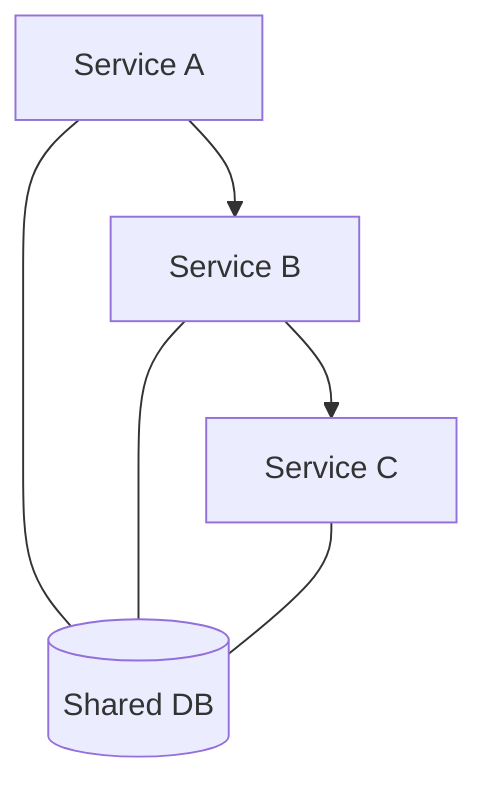

## Diagram

## Summary
An architecture that appears distributed (multiple deployed services) but retains the tight coupling of a monolith. Services share databases, call each other synchronously in deep chains, and cannot be deployed independently. It combines the worst properties of both architectures.

## Symptoms
- Services share the same database tables or schemas
- Deploying one service requires coordinating deployments of several others
- A change in one service's data model breaks multiple downstream services
- Deep synchronous call chains cause cascading failures when any service is slow
- Integration tests require the entire system to be running

## When To Avoid Building One
- Splitting a monolith before establishing clear bounded contexts
- Allowing services to share a database instead of owning their data
- Using synchronous calls for all inter-service communication without fallback strategies
- Skipping contract testing between services

## Pros and Cons

* Bad, because operational complexity of distributed systems without the deployment independence benefit
* Bad, because cascading failures propagate across tight synchronous call chains
* Bad, because shared databases create invisible coupling that breaks independent deployability
* Bad, because testing requires spinning up the full system, negating modular development benefits
* Neutral, because recognizing this pattern is the first step toward refactoring it

## Evolutions
- **From:** Microservices or SOA (when decomposition proceeds without enforcing data ownership and loose coupling)
- **To:** Modular Monolith (consolidate if teams are small), Microservices (enforce data ownership and async communication)
