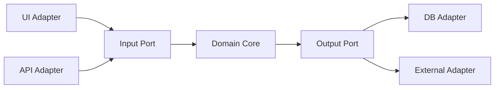

## Diagram

## Summary
Hexagonal Architecture, also known as Ports and Adapters, structures an application so that the domain core is completely isolated from external dependencies. The core exposes ports — technology-neutral interfaces — and all external actors (UI, databases, messaging systems, third-party APIs) connect through adapters that implement those ports. This ensures the application core never depends on infrastructure and can be driven equally well by tests, UIs, or automated scripts.

## When To Use
- The application core must be testable in complete isolation from databases, message brokers, and external services
- Infrastructure components (databases, UI frameworks, messaging) are likely to change or must be swappable
- Multiple delivery mechanisms (REST API, CLI, event consumer) need to drive the same application logic
- Domain complexity justifies the overhead of explicit boundary enforcement

## When To Avoid
- The application is simple CRUD with negligible domain logic — the port/adapter overhead yields little value
- The team is new to the pattern — incorrect adapter placement is common and hard to detect without experience
- Rapid prototyping is the goal — the structure imposes upfront design cost
- The external system is fixed and will never change, eliminating the flexibility benefit

## Pros and Cons

* Good, because the application core is fully testable without spinning up infrastructure
* Good, because infrastructure can be replaced by swapping adapters with no changes to core logic
* Good, because multiple frontends or delivery mechanisms can share the same core without modification
* Good, because ports define an explicit, technology-agnostic API surface for the application
* Bad, because introduces significant indirection — more interfaces, classes, and mapping code than layered architectures
* Bad, because teams unfamiliar with the pattern frequently misplace logic, blurring the core/adapter boundary
* Bad, because the benefits are minimal for applications with simple or thin domain logic

## Evolutions
- **From:** Traditional layered architecture (replace implicit layer coupling with explicit port interfaces)
- **To:** Clean Architecture (formalize the concentric ring model), Onion Architecture (name and organize layers explicitly), Microservices (extract each hexagon into an independent service)
