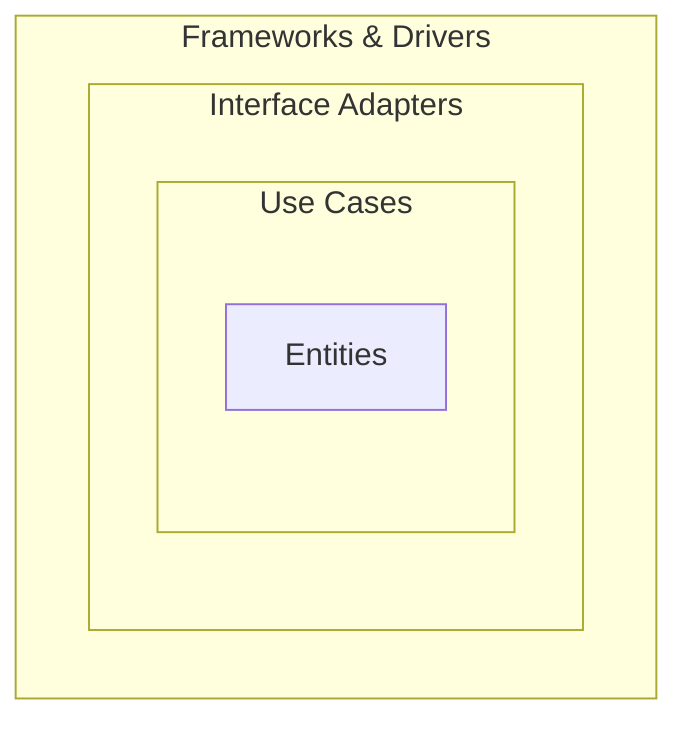

## Diagram

## Summary
Organizes code into concentric rings — Entities (core business rules), Use Cases (application logic), Interface Adapters (controllers/presenters), and Frameworks & Drivers (UI, DB, external) — with a strict inward dependency rule: outer rings depend on inner rings, never the reverse.

## When To Use
- Domain logic must be fully isolated from frameworks, databases, and delivery mechanisms for testability
- The application is expected to swap infrastructure components (DB, UI framework, external APIs) over its lifetime
- Domain rules are complex and must be protected from contamination by technical concerns
- Architecture boundary violations must be enforced at compile-time or via automated architecture tests

## When To Avoid
- The application is primarily CRUD with thin business logic — the indirection adds cost with no benefit
- The team is unfamiliar with dependency inversion — incorrect layer crossings are hard to detect
- Rapid prototyping is the priority — the upfront structure slows initial delivery
- The framework is so central (e.g., Rails) that working against it adds friction with no payoff

## Pros and Cons

* Good, because domain logic is framework-agnostic and fully unit-testable without infrastructure
* Good, because infrastructure components can be swapped with no changes to the core
* Good, because dependency direction is enforceable via linting or architecture tests (ArchUnit, etc.)
* Bad, because requires significantly more code (DTOs, mappers, ports) than a simpler layered approach
* Bad, because the inward dependency rule requires consistent discipline to maintain
* Bad, because over-engineering risk is high for applications with simple domain logic

## Evolutions
- **From:** Hexagonal Architecture (Clean Architecture is a formalization of the ports-and-adapters concept)
- **To:** Domain-Driven Design (add tactical DDD patterns to the core domain ring), Microservices (extract domain rings into independent services)
