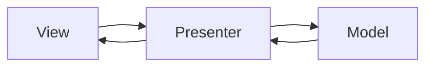

## Diagram

## Summary
Model-View-Presenter is a derivative of MVC in which the View is completely passive — it contains no logic, only renders what it is told. The Presenter mediates all interactions: it receives UI events from the View, queries or updates the Model, and calls View methods directly to update the display. Because the View is a thin interface, it can be replaced with a mock, making the Presenter fully unit-testable. MVP was the dominant Android UI pattern before Jetpack ViewModel and is common in legacy WinForms and GWT applications.

## When To Use
- UI logic must be fully unit-testable without running the real View (e.g., Android instrumentation tests are slow)
- The View layer is difficult to instantiate in tests (native UI components, device-dependent rendering)
- The platform does not support data binding, ruling out MVVM
- Clear responsibility separation is needed between UI rendering and the logic that drives it

## When To Avoid
- The UI framework supports data binding — MVVM or MVI will be less verbose and equally testable
- The View interaction surface is simple — the Presenter interface adds boilerplate without test value
- Bidirectional Presenter-to-View calls become complex for highly dynamic UIs — reactive patterns scale better
- The team is migrating to a modern architecture (Jetpack Compose, SwiftUI) where MVP is a dead end

## Pros and Cons

* Good, because the Presenter has no View dependency beyond an interface, making it fully unit-testable
* Good, because the View is so simple it rarely requires testing — all logic lives in the Presenter
* Good, because the contract between Presenter and View is explicit, documented by the View interface
* Bad, because Presenter-View interface maintenance is tedious — every screen interaction requires interface changes
* Bad, because the pattern does not scale well to complex, highly dynamic UIs where many View methods must be coordinated
* Bad, because compared to MVVM with data binding, MVP requires significantly more boilerplate glue code

## Evolutions
- **From:** MVC (make the View fully passive and transfer all UI logic from Controller to Presenter)
- **To:** MVVM (replace the imperative Presenter-calls-View pattern with declarative data binding), Clean Architecture (treat the Presenter as the Interface Adapter layer driving a use-case boundary)
