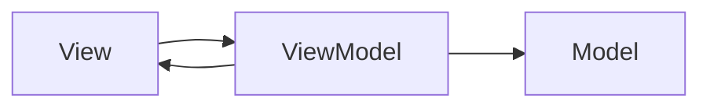

## Diagram

## Summary
Model-View-ViewModel is a UI architectural pattern derived from MVC for data-binding-heavy platforms. The ViewModel exposes observable properties and commands that the View binds to declaratively; when ViewModel state changes, the View updates automatically without any imperative glue code. The Model holds domain data and business logic, the View is a thin declarative template, and the ViewModel acts as the View's state machine and command handler. Originated in Microsoft WPF and is now the dominant pattern in WPF, Android (Jetpack), SwiftUI, and Angular.

## When To Use
- The UI framework supports two-way or reactive data binding (WPF, SwiftUI, Jetpack Compose, Angular)
- The View must react to frequent state changes from the Model without manual synchronization
- UI logic must be fully unit-testable without instantiating View components
- Multiple Views need to share the same ViewModel state (e.g., split-pane or widget scenarios)

## When To Avoid
- The UI framework does not support data binding — implementing MVVM manually introduces more boilerplate than MVC
- The UI is simple and static — MVVM's observable machinery adds complexity with little benefit
- The team is unfamiliar with reactive or observable patterns — misuse leads to memory leaks and binding cycles
- Server-side rendered applications where request-response MVC is a better fit

## Pros and Cons

* Good, because ViewModels contain no View references and are trivially unit-testable
* Good, because data binding eliminates manual synchronization code between View and state
* Good, because the View becomes a thin, declarative template with minimal logic to test manually
* Bad, because over-engineering is common — simple screens accumulate unnecessary observable machinery
* Bad, because two-way binding can create hard-to-trace feedback loops and debugging complexity
* Bad, because memory leak risk from undisposed bindings or observer subscriptions is high without discipline

## Evolutions
- **From:** MVC (replace imperative Controller-to-View updates with declarative data binding via ViewModel)
- **To:** Reactive Architecture (extend observable state to full reactive streams — RxJava, Combine, Flow), Unidirectional Data Flow (constrain binding to one-way — Redux, MVI — for predictability)
