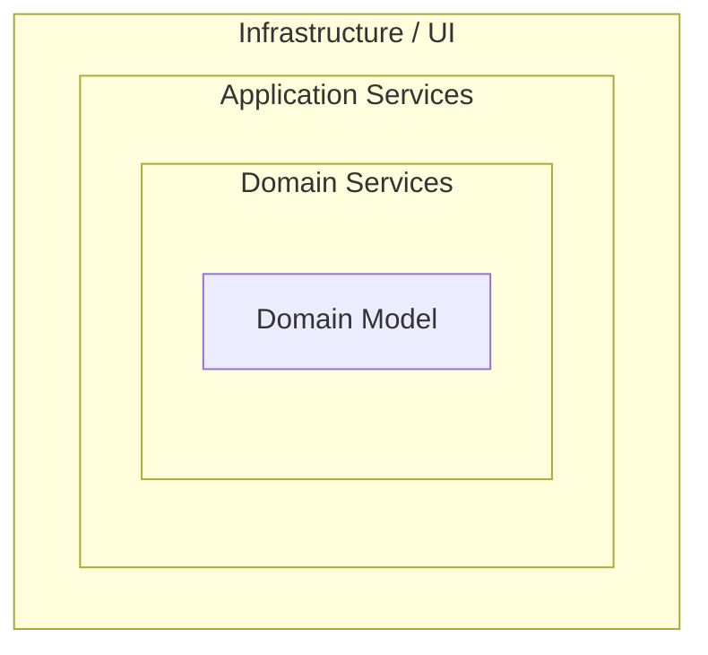

## Diagram

## Summary
Onion Architecture organizes code into concentric layers — Domain Model (innermost), Domain Services, Application Services, and Infrastructure/UI (outermost) — with the same inward-only dependency rule as Clean Architecture: outer layers depend on inner layers, never the reverse. The domain model has no external dependencies whatsoever. Introduced by Jeffrey Palermo, Onion Architecture differs from Clean Architecture mainly in layer naming conventions; both are formal expressions of the Hexagonal Architecture principle.

## When To Use
- Domain logic is complex and must be protected from changes in UI, persistence, or external integrations
- Teams want a well-named, explicit layer structure that maps clearly to DDD concepts
- Infrastructure must be swappable or mockable for testing without changing application logic
- The project benefits from a shared vocabulary for layer responsibilities across the team

## When To Avoid
- The application has thin or trivial domain logic — the full layer stack adds overhead with minimal payoff
- Teams unfamiliar with inversion of control tend to violate the dependency rule, negating the architecture's benefits
- Time-to-market pressure makes the upfront layer scaffolding cost prohibitive
- The codebase is small enough that a simple two-layer (business logic + infrastructure) split suffices

## Pros and Cons

* Good, because the domain model has zero external dependencies and is trivially unit-testable
* Good, because layer responsibilities are explicitly named, making onboarding and navigation easier
* Good, because infrastructure (persistence, messaging, UI) can be replaced without touching domain code
* Bad, because requires more classes, interfaces, and mapping code than flat or two-tier architectures
* Bad, because the layer naming differs from Clean Architecture, causing confusion when teams mix terminology
* Bad, because benefits are proportional to domain complexity — thin domains do not justify the structure

## Evolutions
- **From:** Hexagonal Architecture (Onion Architecture names and formalizes the concentric layer model)
- **To:** Clean Architecture (alternative naming convention for the same concept), Domain-Driven Design (populate the inner layers with DDD tactical patterns)
