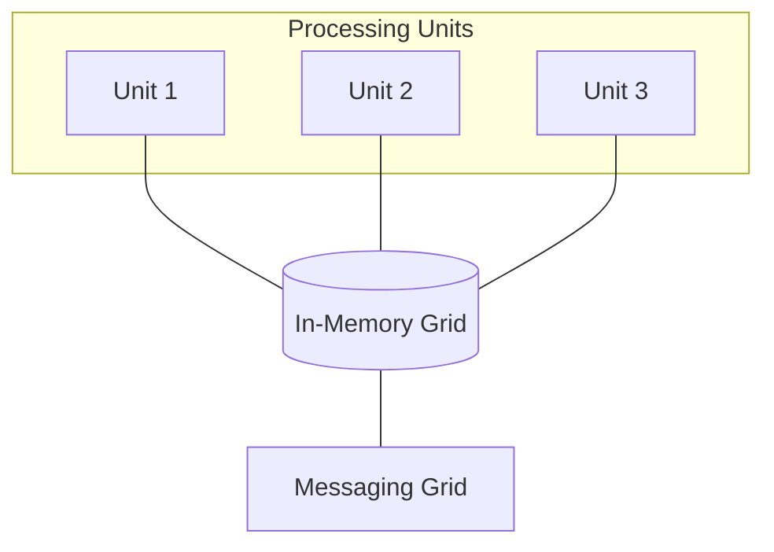

## Diagram

## Summary
Space-Based Architecture eliminates the database as a central bottleneck by distributing both processing and data across a grid of identical processing units. Each unit holds a replica of the shared in-memory tuple space (the "space"); all reads and writes go to local memory, and changes are propagated asynchronously to other units. A messaging grid coordinates unit communication, and a data-replication engine synchronizes the in-memory state. Designed for extreme write scalability and elastic load handling, it is well-suited to high-volume transactional systems (ticketing, trading, gaming leaderboards).

## When To Use
- The application must handle extreme, variable write loads that would overwhelm a central database
- Elastic scaling — spinning up and down processing units dynamically in response to load — is a core requirement
- Latency must be consistently low, making synchronous database round-trips unacceptable on the hot path
- The problem domain tolerates eventual consistency between processing units

## When To Avoid
- Strong ACID consistency across all data is required — the asynchronous replication model makes global consistency expensive or impossible
- The data model is highly relational and requires complex cross-entity joins — the tuple space model is a poor fit
- The operational team lacks expertise in distributed in-memory data grids (Hazelcast, GemFire, Coherence) — the infrastructure complexity is substantial
- Write volume is modest and a well-indexed relational database with read replicas would suffice

## Pros and Cons

* Good, because eliminating synchronous database writes removes the most common scalability bottleneck in high-throughput systems
* Good, because processing units are identical and stateless with respect to the shared space, enabling true elastic horizontal scaling
* Good, because in-memory data access provides sub-millisecond read and write latency on the hot path
* Bad, because eventual consistency between processing units requires the application to tolerate and handle stale reads
* Bad, because the in-memory grid infrastructure (replication, eviction, persistence) is operationally complex and expensive
* Bad, because data volume is constrained by aggregate memory across the grid — large datasets require costly memory provisioning

## Evolutions
- **From:** Shared-database architecture (remove the central database write bottleneck by distributing data into a processing-unit-local in-memory grid)
- **To:** Event-Sourced Architecture (combine with an event log to provide a durable audit trail alongside the in-memory space), CQRS (separate the write-optimized in-memory space from a read-optimized projection store)
