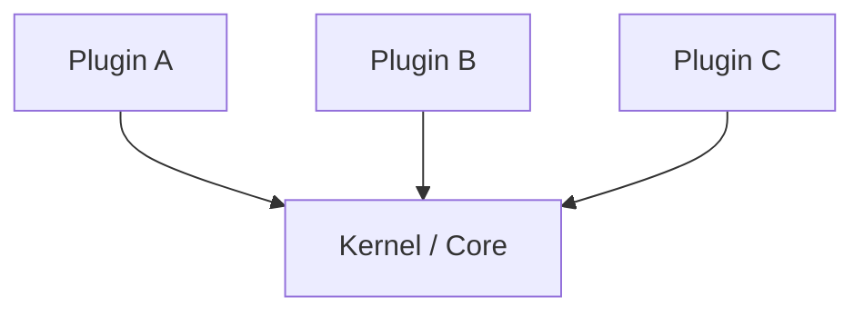

## Diagram

## Summary
The Microkernel pattern organizes a system around a minimal, stable core that provides only the essential services needed to load and coordinate plug-in modules. All other functionality is implemented as plug-ins that are discovered, loaded, and managed by the core at startup or on demand. The core and plug-ins communicate through well-defined interfaces, and the system's capabilities are determined by which plug-ins are present. Widely used in operating system kernels, IDEs, and application servers.

## When To Use
- The system requires a stable, long-lived core while feature sets need to evolve independently
- Different deployments or customers require different combinations of functionality
- Third-party or community-developed extensions must be accommodated without modifying the core
- Fault isolation is important — a failing plug-in should not crash the core

## When To Avoid
- The feature set is fixed and known upfront — plug-in infrastructure adds complexity with no extensibility payoff
- Performance is paramount — plug-in dispatch and dynamic loading introduce overhead
- The team is small and the domain is simple — a modular monolith is sufficient and easier to reason about
- Security requirements are strict — arbitrary plug-in loading significantly expands the attack surface

## Pros and Cons

* Good, because the core is small, stable, and independently releasable from plug-ins
* Good, because new functionality can be added by writing and deploying a plug-in without touching the core
* Good, because deployments can be customized by selecting the appropriate plug-in set
* Bad, because designing a plug-in API that is both stable and sufficiently expressive is difficult and expensive
* Bad, because debugging issues that span core and plug-in boundaries is more complex than in a monolith
* Bad, because plug-in versioning and dependency management grow into a significant operational burden

## Evolutions
- **From:** Monolithic application (extract variable behavior into plug-in modules around a stable core)
- **To:** Container Orchestrator (the microkernel idea applied to containerized workload management), Software Framework (the core inverts control and calls plug-ins via hooks)
