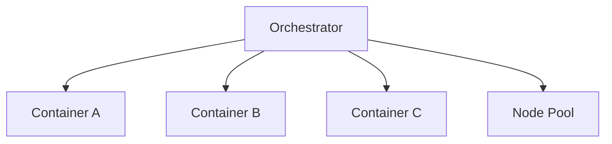

## Diagram

## Summary
A Container Orchestrator is a microkernel that manages the full lifecycle of containerized workloads: scheduling containers onto nodes, scaling them up or down, handling networking and service discovery, managing persistent storage, and restarting failed instances. The orchestrator's core is minimal and stable; user workloads are effectively plug-ins that declare their resource requirements and the orchestrator satisfies them. Kubernetes is the canonical example; others include Nomad and Amazon ECS.

## When To Use
- Deploying many containerized services that need automated scheduling, scaling, and failure recovery
- Infrastructure must be treated as code — workload definitions (manifests) should be version-controlled and reproducible
- Services must be dynamically placed across a heterogeneous pool of machines based on resource availability
- Zero-downtime deployments, rolling updates, and health-check-driven restarts are required

## When To Avoid
- The deployment target is a single machine — the orchestration overhead far exceeds the operational benefit
- The team lacks expertise with container orchestration — the operational complexity of systems like Kubernetes is substantial
- The application is monolithic or has very few services — a simpler PaaS or VM-based deployment is more appropriate
- Startup or prototyping context where deployment simplicity outweighs operational sophistication

## Pros and Cons

* Good, because workload scheduling, scaling, and self-healing are automated, reducing operational toil
* Good, because workload definitions are declarative and version-controlled, enabling reproducible deployments
* Good, because the orchestrator abstracts heterogeneous infrastructure, allowing workloads to be infrastructure-agnostic
* Bad, because operational complexity is high — Kubernetes in particular has a steep learning curve and significant failure modes
* Bad, because the abstraction layers make debugging networking, storage, and scheduling issues difficult
* Bad, because resource overhead of the orchestrator itself is non-trivial and unsuitable for resource-constrained environments

## Evolutions
- **From:** Manual VM provisioning or simple PaaS (introduce automated scheduling and lifecycle management for containerized workloads)
- **To:** Service Mesh (add a mesh layer for fine-grained traffic management between orchestrated services), Space-Based Architecture (distribute state across orchestrated processing units to eliminate database bottlenecks)
