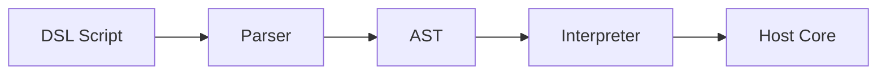

## Diagram

## Summary
A Domain-Specific Language is a specialized mini-language tailored to a narrow problem domain. The host system acts as the microkernel; DSL scripts or programs are the plug-ins that extend its behavior without modifying the core. DSLs can be internal (embedded in a host language using its syntax — Ruby DSLs, Gradle Kotlin DSL) or external (a standalone language with its own parser — SQL, CSS, Gherkin, HCL). DSLs raise abstraction to domain concepts, allowing domain experts to express intent directly without general-purpose programming knowledge.

## When To Use
- Domain experts (non-programmers) need to author, read, or modify behavior without learning a general-purpose language
- A recurring class of problems is expressed far more concisely in domain vocabulary than in general-purpose code
- Configuration or rule sets are complex enough that a structured language is clearer than data formats (YAML, JSON)
- The host system needs to be extended by users at runtime without recompilation or redeployment

## When To Avoid
- The domain is too broad — general-purpose languages are more appropriate when the problem space is unbounded
- The DSL would be used by a handful of developers who are comfortable with the host language — the parser/interpreter cost is unjustified
- The DSL's syntax is likely to evolve frequently — parser and tooling maintenance becomes a significant burden
- Debugging, error messaging, and IDE tooling for the DSL would be prohibitively expensive to build

## Pros and Cons

* Good, because domain experts can read and write DSL programs without understanding implementation details
* Good, because DSL code is significantly more concise and expressive than equivalent general-purpose code for its domain
* Good, because the host system's behavior can be extended via DSL scripts without recompilation
* Bad, because building a parser, interpreter, error handling, and tooling for an external DSL is expensive
* Bad, because a poorly designed DSL becomes a maintenance liability — every language change breaks existing scripts
* Bad, because debugging DSL programs is harder than debugging general-purpose code due to limited tooling and error context

## Evolutions
- **From:** Configuration files or hard-coded logic (introduce a structured language to make domain behavior expressible and extensible)
- **To:** General-purpose embedded language (if DSL requirements grow beyond the domain, embed Lua, Python, or JS as a scripting engine instead)
