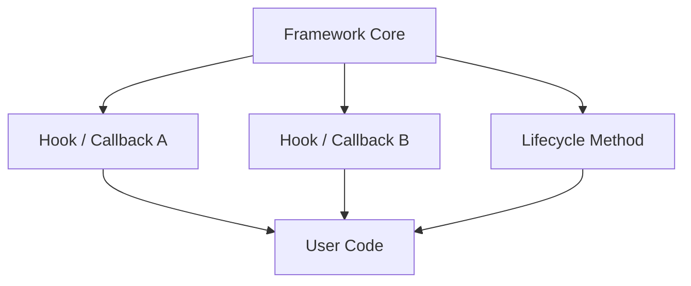

## Diagram

## Summary
A Software Framework is a reusable, extensible application skeleton that provides inversion of control: the framework calls user code rather than the reverse. Users extend predefined extension points — hooks, callbacks, abstract base classes, or annotated methods — and the framework orchestrates their execution within a predefined lifecycle. This "Hollywood Principle" (don't call us, we'll call you) distinguishes a framework from a library. Examples include Spring, Rails, Django, Angular, and JUnit.

## When To Use
- Building a platform or toolkit where multiple teams will implement similar applications with shared infrastructure
- A well-defined lifecycle or workflow (request handling, test execution, UI rendering) can be extracted and reused
- Extension points are known upfront and can be stabilized as a public API
- Reducing boilerplate across many applications sharing the same architectural concerns is a priority

## When To Avoid
- The shared lifecycle is unclear or unstable — a premature framework locks in the wrong abstractions
- Applications built on the framework have wildly different lifecycles — the framework becomes a forcing function that fights users
- A simpler library would suffice — not every reusable component needs to own the program's control flow
- The team building the framework is also the only consumer — the generalization cost outweighs the savings

## Pros and Cons

* Good, because application developers write only the unique logic, letting the framework handle cross-cutting concerns
* Good, because consistent extension points enforce architectural uniformity across all applications built on the framework
* Good, because the framework can evolve infrastructure (security, observability, serialization) transparently for all consumers
* Bad, because the framework's lifecycle owns the application, making it difficult to escape or partially adopt
* Bad, because poorly designed extension points are hard to fix after publication without breaking consumers
* Bad, because framework "magic" (hidden control flow, annotation processing) increases debugging difficulty

## Evolutions
- **From:** Library (invert control — instead of the application calling the library, the framework calls the application)
- **To:** Microkernel (extend the framework model so that the core itself is minimal and all domain logic arrives as plug-in modules), Container Orchestrator (apply the framework's lifecycle management to containerized workloads)
