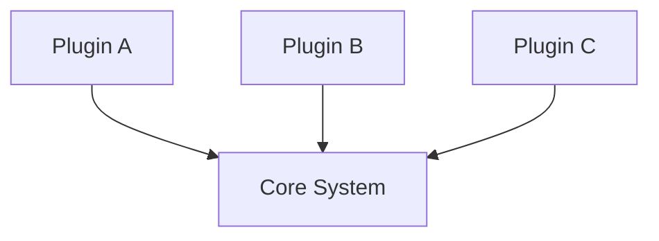

## Diagram

## Summary
The Plugin metapattern allows a core system to be extended with additional functionality at runtime or build time without modifying the core. Extensions (plugins) conform to a defined interface and are discovered and loaded by the core, enabling open-ended extensibility while keeping the host system stable. Common examples include IDE extensions, browser add-ons, CMS plugins, and build-tool plugins.

## When To Use
- The system must support third-party or community extensions without access to core source code
- Functionality requirements are open-ended and cannot all be anticipated at design time
- Different deployments require different feature sets drawn from a shared catalog
- The core must remain stable and independently releasable from its extensions

## When To Avoid
- The extension surface is small and fixed — the overhead of a plugin infrastructure adds complexity with no benefit
- Security constraints make arbitrary code loading unacceptable without significant sandboxing effort
- The team needs predictable, static behavior that is easy to audit — dynamic plugin loading complicates reasoning
- Performance is critical and the indirection of plugin dispatch introduces unacceptable overhead

## Pros and Cons

* Good, because the core system is stable and modifications are isolated to individual plugins
* Good, because extensions can be developed and deployed independently of the core
* Good, because enables community and third-party ecosystem growth without core team involvement
* Bad, because plugin API versioning and backward compatibility become a long-term maintenance burden
* Bad, because dynamic loading makes static analysis, debugging, and testing harder
* Bad, because a poorly defined plugin contract can lead to tight coupling or brittle integrations

## Evolutions
- **From:** Monolithic application (extract extension points to allow variation without forking)
- **To:** Microkernel (promote the plugin model to the core architectural style), Software Framework (invert control so the framework calls plugins via hooks)
