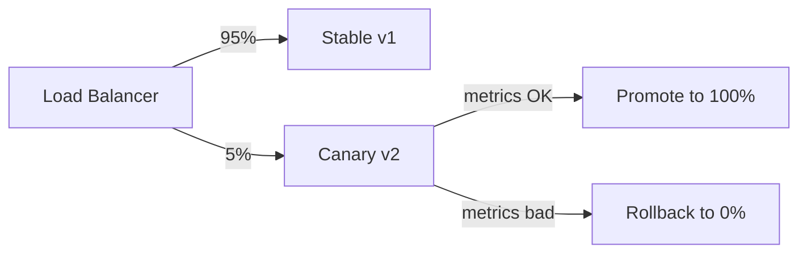

## Diagram

## Summary

A family of patterns for releasing changes to production systems safely, incrementally, and with controlled blast radius. Each pattern offers a different trade-off between deployment speed, risk exposure, and the ability to roll back. The common goal is decoupling the act of deploying code from the act of exposing it to users.

## When To Use

- Production changes must not cause downtime
- Rollback must be possible without redeploying code
- New versions need validation against real traffic before full promotion

## When To Avoid

- Systems with no availability requirements where full replacement is acceptable
- Environments where infrastructure cannot support parallel versions

## Pros and Cons

* Good, because production incidents can be contained to a subset of users and reversed quickly
* Good, because new versions can be validated against real load before full promotion
* Bad, because multiple live versions increase operational complexity (data migrations, API compatibility)
* Bad, because partial rollouts require the system to support multiple concurrent versions

## Evolutions

- **From:** Any basic topology that has reached production and requires change management
- **To:** Combine with Observability (measure version quality) and Resilience (circuit-break a bad version automatically)
