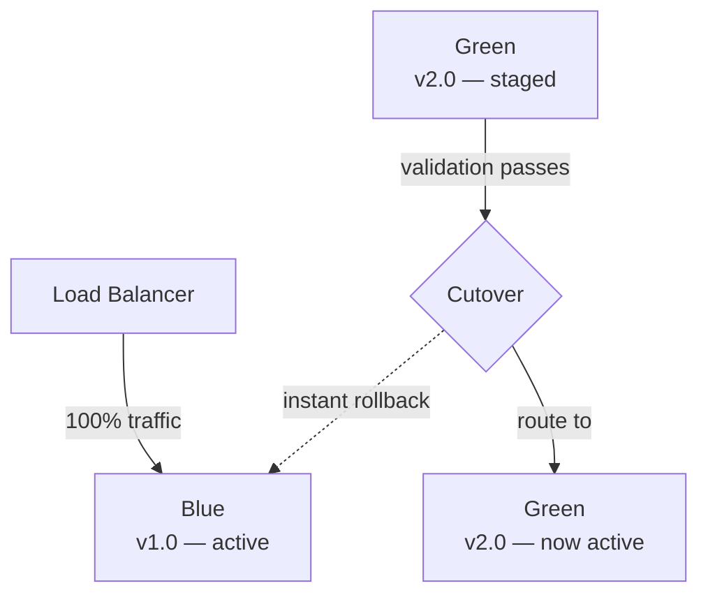

## Diagram

## Summary

Maintains two identical production environments — Blue (currently live) and Green (new version staged). The new version is deployed to Green and validated while Blue continues serving all traffic. Cutover is an instantaneous switch of the load balancer; rollback is equally instant. At any moment, only one environment is live, but both are fully provisioned.

## When To Use

- Zero-downtime deployment is required
- Rollback must be possible in seconds without redeploying code
- The new version can be validated in a production-identical environment before receiving traffic

## When To Avoid

- Infrastructure cost of maintaining two full environments simultaneously is prohibitive
- Database schema changes are coupled to the release and cannot support both versions simultaneously
- The system state (sessions, caches) cannot be shared or migrated between environments

## Pros and Cons

* Good, because cutover and rollback are instantaneous — a single load balancer update
* Good, because the new version is validated in a production environment before any user traffic is affected
* Bad, because two full production environments must be provisioned and maintained simultaneously
* Bad, because stateful resources (databases, queues) must be compatible with both versions during the cutover window

## Evolutions

- **From:** In-place deployment with downtime or rolling updates
- **To:** Canary Release (shift traffic gradually instead of all at once); Feature Flags (decouple deployment from feature exposure within a single environment)
