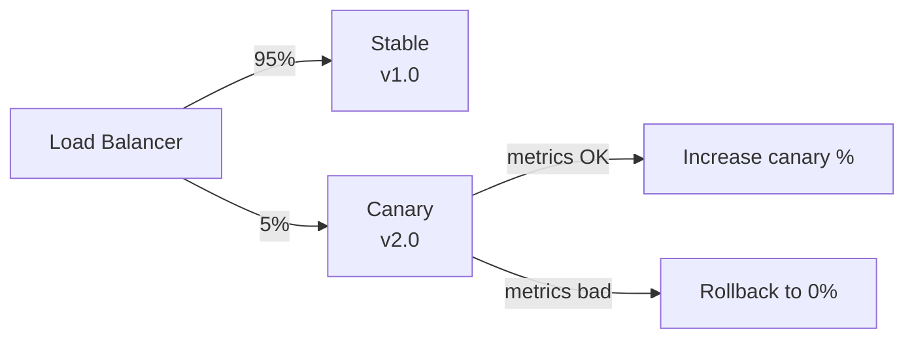

## Diagram

## Summary

Gradually shifts a small percentage of production traffic to the new version while the majority continues on the stable version. Metrics and error rates on the canary are compared against the baseline; if they are healthy, the traffic percentage is increased incrementally until the canary serves 100% and the old version is decommissioned. If the canary shows regressions, traffic is shifted back without a full incident.

## When To Use

- Production traffic is the only reliable test of a new version's behavior under real load
- A regression in the new version must be detectable and reversible before it affects all users
- The infrastructure supports routing a percentage of traffic to a different service version

## When To Avoid

- Traffic cannot be split at the infrastructure layer (e.g., monolithic deployments with no routing control)
- The service has no metrics that can reliably distinguish a healthy canary from a bad one
- Both versions cannot coexist simultaneously (incompatible database schema changes)

## Pros and Cons

* Good, because regressions are detected on a small fraction of users before full rollout
* Good, because rollback is a traffic weight adjustment — fast and non-destructive
* Bad, because both versions run simultaneously, requiring API and data compatibility between them
* Bad, because a meaningful canary requires sufficient traffic volume — low-traffic services may not accumulate enough signal quickly

## Evolutions

- **From:** Blue/Green Deployment (add gradual rollout instead of instant cutover)
- **To:** Feature Flags (move traffic splitting into the application layer for per-user targeting); Shadow Deployment (validate against real traffic before any user is exposed)
