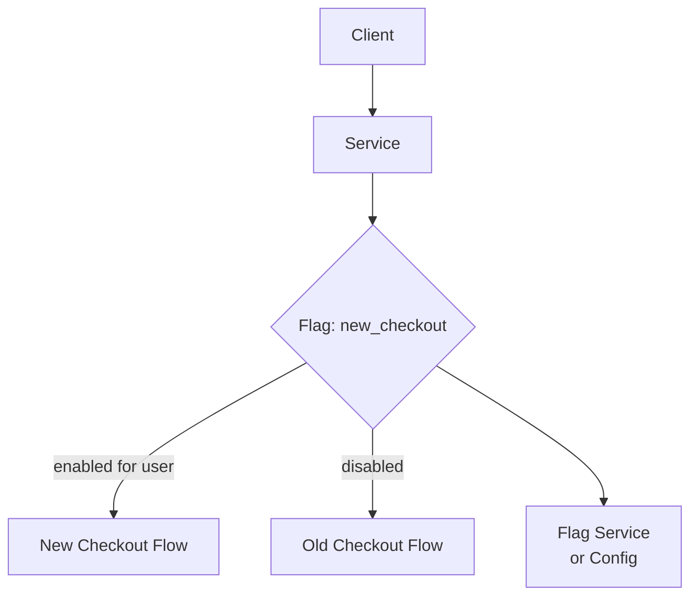

## Diagram

## Summary

Wraps new or experimental code paths behind a conditional check against a runtime configuration value. Flags decouple deployment (merging code to production) from release (exposing that code to users). This enables trunk-based development, dark launches, targeted rollouts (by user segment, percentage, or geography), and instant kill-switches for problematic features — all without redeploying code.

## When To Use

- Code must be deployed to production before it is ready for all users
- Features must be rolled out to a specific user segment or gradually by percentage
- A kill-switch is needed to disable a feature instantly without a rollback deployment

## When To Avoid

- Flags accumulate and are never cleaned up — this creates permanent branching logic that becomes unmaintainable
- The flag controls infrastructure-level behavior where a code change is cleaner and safer
- Flags are used to maintain long-lived divergent code paths (use branching instead)

## Pros and Cons

* Good, because features can be exposed incrementally or to specific users without redeployment
* Good, because a kill-switch can disable a misbehaving feature in seconds
* Bad, because every flag is a branch that must be tested in both states — combinatorial complexity grows with flag count
* Bad, because flags require cleanup discipline — stale flags accumulate as permanent dead branches if not removed

## Evolutions

- **From:** Deployment = release (code goes live when it ships)
- **To:** Canary Release (use flags as the traffic-splitting mechanism within a single deployment); integrate with A/B testing infrastructure for experimentation
