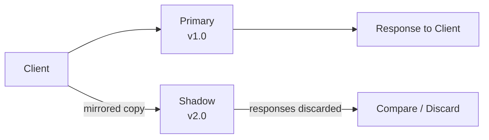

## Diagram

## Summary

Routes a copy of real production traffic to the new version in parallel with the primary version. The shadow processes requests but its responses are discarded — users see only primary responses. This validates that the new version handles real traffic correctly (performance, errors, side effects) before it is ever exposed to users, combining the realism of production load with zero user risk.

## When To Use

- The new version must be validated under real production load patterns that are hard to replicate in staging
- Correctness and performance can be verified by comparing shadow responses to primary responses
- The new version's side effects (writes, external calls) can be safely duplicated or suppressed in shadow mode

## When To Avoid

- Side effects (writes, charges, emails) cannot be safely duplicated in shadow mode — the shadow would cause real-world consequences
- Infrastructure cost of routing and processing all traffic twice is prohibitive
- Traffic volume is too low to generate statistically meaningful shadow validation

## Pros and Cons

* Good, because the new version is tested against real production traffic with zero user exposure
* Good, because performance regressions and error rate differences surface before any cutover
* Bad, because writes and external calls from the shadow must be handled carefully to avoid unintended side effects
* Bad, because running both versions in parallel doubles infrastructure cost for the validation period

## Evolutions

- **From:** Staging environment testing with synthetic or replayed traffic
- **To:** Canary Release (expose shadow-validated versions to a small percentage of real users); combine with Metrics Collection to automate pass/fail decisions
