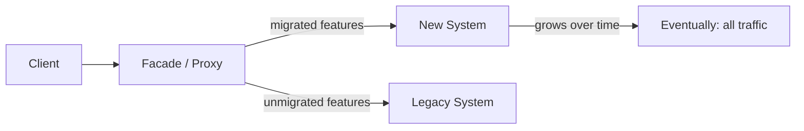

## Diagram

## Summary

Incrementally replaces a legacy system by routing new or migrated functionality through a facade to the new system, while the legacy continues to serve unmigrated functionality. The new system grows over time — strangling the legacy — until the legacy handles no traffic and can be decommissioned. Named after the strangler fig tree that grows around an existing tree until it replaces it entirely.

## When To Use

- A legacy system must be replaced but a big-bang rewrite carries too much risk
- The system can be decomposed into independently migrable features or domains
- A routing layer (proxy, facade, or API gateway) can be placed in front of the legacy system

## When To Avoid

- The legacy system is a monolith with no clean feature boundaries — routing logic becomes unmaintainable
- The legacy and new systems cannot operate with shared or synchronized state
- The migration timeline is so short that incremental replacement offers no advantage over a planned cutover

## Pros and Cons

* Good, because migration risk is spread across many small, reversible steps rather than one big cutover
* Good, because the new system receives production traffic from day one — no big-bang validation required
* Bad, because two systems must coexist and stay synchronized during the migration, which can span months or years
* Bad, because the routing facade accumulates complexity and must be maintained for the duration of the migration

## Evolutions

- **From:** Big-bang rewrite or in-place refactoring of the legacy system
- **To:** Apply Anticorruption Layer at the boundary between old and new systems to prevent legacy data models from leaking into the new design
