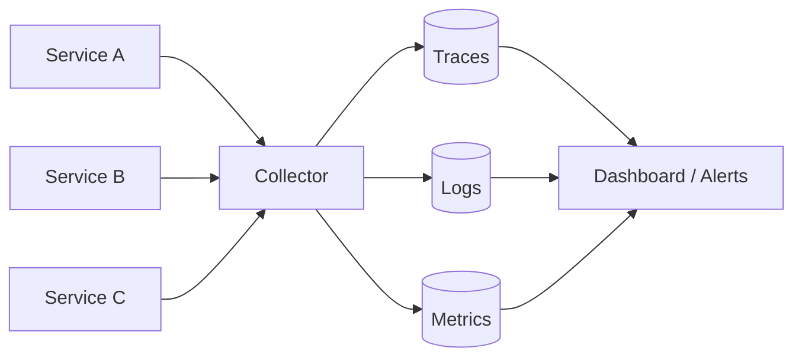

## Diagram

## Summary

A family of patterns for gaining visibility into the internal state of a running distributed system through its external outputs — traces, logs, and metrics. Observability is not a single tool but a property of a system: a well-observed system can be understood and debugged without deploying new code.

## When To Use

- The system is distributed across multiple services or processes
- Failures need to be diagnosed quickly without direct access to running instances
- SLOs and error budgets must be measured and tracked

## When To Avoid

- Single-process scripts or batch jobs with short lifetimes
- Systems where the cost of instrumentation exceeds the cost of occasional downtime

## Pros and Cons

* Good, because system behavior can be understood and debugged from the outside without code changes
* Good, because anomalies and SLO breaches are detected proactively before users are impacted
* Bad, because instrumentation adds overhead — cardinality, sampling rates, and retention costs require active management
* Bad, because raw telemetry volume grows with system complexity and must be actively managed

## Evolutions

- **From:** Any basic topology operating in a distributed environment
- **To:** Combine with Resilience (trigger automated responses to observed degradation) and Deployment patterns (compare metrics across versions)
