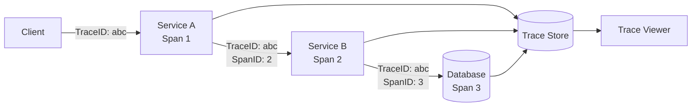

## Diagram

## Summary

Propagates a unique trace identifier through every service call in a request's path, recording timing and metadata at each hop as a span. Spans are collected into a trace that reconstructs the full call graph of any single request across all services. Enables root-cause analysis of latency and failures in distributed systems where a single user request may touch dozens of components.

## When To Use

- A request crosses multiple service boundaries and diagnosing failures requires understanding the full call path
- Latency regressions need to be pinpointed to specific services or database calls
- Errors in downstream services must be correlated back to originating requests

## When To Avoid

- Single-service or single-process applications where a local profiler or logs are sufficient
- Systems where trace propagation overhead is unacceptable (very high-throughput, latency-critical hot paths — use sampling instead)

## Pros and Cons

* Good, because the complete call graph of any request is reconstructable from trace data alone
* Good, because latency breakdowns show exactly which span dominates total request time
* Bad, because all services must instrument and propagate trace context — partial adoption produces incomplete traces
* Bad, because high-cardinality trace storage is expensive — sampling strategies trade completeness for cost

## Evolutions

- **From:** Per-service logs with no correlation between services
- **To:** Combine with Log Aggregation (correlate logs to spans via trace ID) and Metrics Collection (use trace data to inform latency SLOs)
