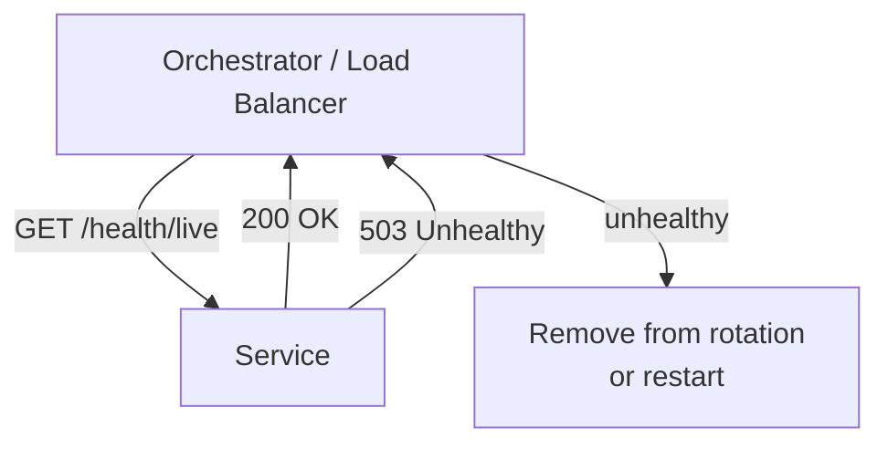

## Diagram

## Summary

Exposes a dedicated endpoint that reports whether a service instance is alive and able to serve traffic. Liveness checks report whether the process is functioning at all (failure → restart); readiness checks report whether the instance is ready to receive traffic (failure → remove from load balancer). Orchestrators and load balancers poll health endpoints to route traffic only to healthy instances.

## When To Use

- Services run in an orchestrated environment (container orchestrator, load balancer pool) that needs to route traffic only to healthy instances
- Instances should be restarted or removed from rotation automatically without operator intervention
- Startup time is variable and instances should not receive traffic until fully initialized

## When To Avoid

- Single-instance deployments where instance health is monitored manually
- Environments with no orchestration layer that would act on health signals

## Pros and Cons

* Good, because unhealthy instances are removed from traffic automatically — no operator intervention required
* Good, because liveness and readiness separation prevents traffic from reaching an initializing or overwhelmed instance
* Bad, because a poorly designed health check that always returns 200 defeats the purpose — checks must reflect real readiness
* Bad, because overly strict health checks (checking all dependencies) can cause mass removal of healthy instances during a partial downstream outage

## Evolutions

- **From:** Manual monitoring of instance state via logs or external pings
- **To:** Expose health status as a metric (via Metrics Collection) to build SLO dashboards on availability; use health signals to trigger Circuit Breaker for unhealthy downstream services
