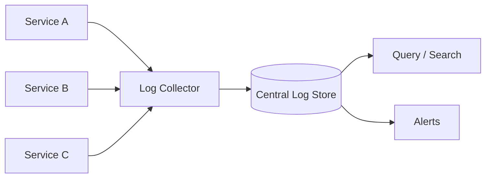

## Diagram

## Summary

Collects log output from all service instances into a single queryable store, rather than leaving logs scattered across individual host filesystems. Structured logs (key-value or JSON) are preferable to free-form text because they enable filtering, aggregation, and correlation by fields such as trace ID, user ID, or error code. Log aggregation is the baseline for debugging distributed systems.

## When To Use

- The system runs multiple service instances and logs are needed across all of them to diagnose an incident
- Post-incident analysis requires replaying the sequence of events across services
- Alerts should fire on error rates or specific log patterns

## When To Avoid

- Single-instance applications where local log files are directly accessible
- Systems where log volume or retention costs outweigh the debugging benefit — sample aggressively or reduce verbosity

## Pros and Cons

* Good, because logs from all instances are searchable in one place — no need to SSH into individual hosts
* Good, because structured logs enable precise filtering and aggregation by any field
* Bad, because log volume grows with traffic — retention, indexing, and storage costs require active management
* Bad, because unstructured or inconsistent log formats degrade searchability

## Evolutions

- **From:** Per-host log files accessed via SSH or file transfer
- **To:** Enrich logs with trace IDs (via Distributed Tracing) to correlate log entries to specific requests; use log-derived error rates as inputs to Metrics Collection
