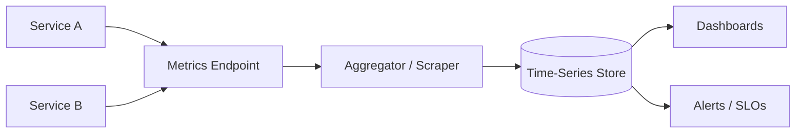

## Diagram

## Summary

Instruments services to emit numeric measurements over time — request rates, error rates, latency percentiles, queue depths, resource utilization — and aggregates them into a time-series store for dashboarding and alerting. Common frameworks include the RED method (Rate, Errors, Duration) for services and the USE method (Utilization, Saturation, Errors) for resources. Metrics are the primary signal for SLO tracking and on-call alerting.

## When To Use

- SLOs (error rate, latency percentiles) must be tracked and alerted on
- Capacity planning requires understanding resource utilization trends over time
- Dashboards must show system health at a glance during incidents

## When To Avoid

- Systems with a single instance where direct inspection is faster than instrumentation
- Metrics that would have unbounded cardinality (e.g., per-user-ID labels) — these explode storage and query cost

## Pros and Cons

* Good, because numeric aggregates over time enable precise SLO definition and alerting
* Good, because time-series data supports capacity planning, trend analysis, and anomaly detection
* Bad, because high-cardinality labels cause exponential storage growth and must be carefully controlled
* Bad, because metrics show what is happening but not why — debugging root causes requires traces and logs

## Evolutions

- **From:** Ad-hoc dashboards or manual inspection during incidents
- **To:** Define SLOs against metrics; use metrics to trigger Circuit Breaker or Fallback automation; correlate metric anomalies with deployments via Canary Release or Feature Flags
