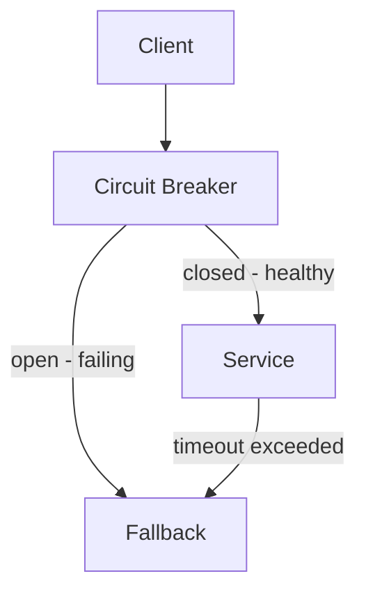

## Diagram

## Summary

A family of patterns that protect a system's availability when downstream components fail or are overloaded. Each pattern addresses a specific failure mode: cascading failures, resource exhaustion, retry storms, and capacity overload. Applied together, they allow a system to degrade gracefully rather than fail catastrophically.

## When To Use

- The system depends on external services or downstream components that may become unavailable
- Partial outages should not propagate into total outages
- The system must remain available under unexpected load spikes or dependency failures

## When To Avoid

- Simple single-process applications with no distributed dependencies
- Systems where a degraded response is worse than a hard failure (e.g., financial transactions requiring strict consistency)

## Pros and Cons

* Good, because failures in individual dependencies are contained and do not cascade
* Good, because the system can self-heal automatically as failing dependencies recover
* Bad, because each pattern requires careful tuning of thresholds, timeouts, and retry budgets
* Bad, because degraded responses can mask underlying problems if not paired with observability

## Evolutions

- **From:** Any basic topology operating with distributed dependencies
- **To:** Combine with Observability (detect and alert on degraded states) and Deployment patterns (roll back failing releases safely)
