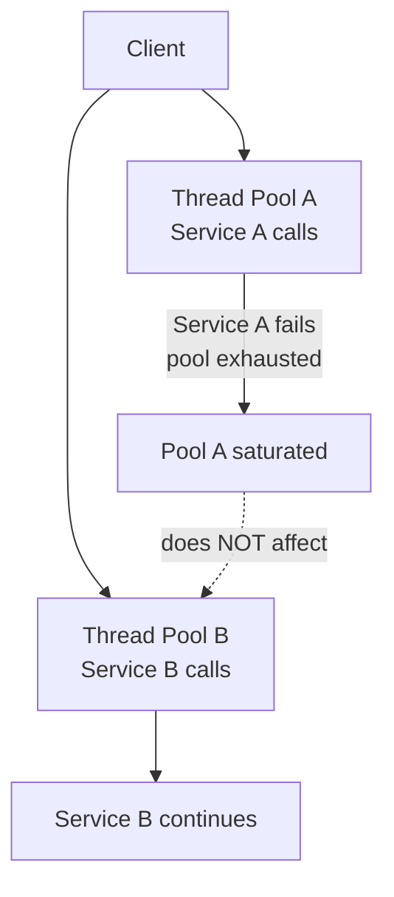

## Diagram

## Summary

Divides a system's resources — threads, connections, memory — into isolated pools, one per downstream dependency or workload class. When one pool is exhausted by a slow or failing dependency, other pools remain unaffected. Named after the watertight compartments in a ship's hull: flooding one compartment does not sink the ship.

## When To Use

- The system calls multiple downstream dependencies and a slow dependency could exhaust shared resources
- Different workload classes (e.g., user-facing vs. background jobs) must not compete for the same capacity
- Blast radius of a single dependency failure must be contained

## When To Avoid

- Resources are so limited that partitioning them would starve individual pools
- All dependencies share the same failure domain and isolation would provide no benefit
- The system calls only one downstream dependency

## Pros and Cons

* Good, because a saturated pool for one dependency cannot starve capacity for others
* Good, because failure isolation is structural — no runtime logic or thresholds to tune
* Bad, because total resource capacity is reduced by the overhead of pre-allocated pools
* Bad, because pool sizes must be tuned per dependency — too small causes unnecessary rejection, too large wastes capacity

## Evolutions

- **From:** Shared thread/connection pools across all dependencies
- **To:** Combine with Circuit Breaker (stop calls before they consume pool capacity) and Observability (alert on pool saturation)
