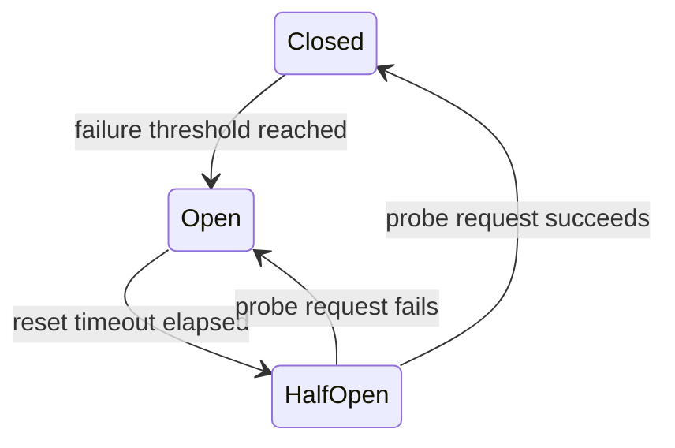

## Diagram

## Summary

Wraps calls to a downstream dependency in a state machine. In the Closed state, calls pass through normally; failures are counted. When failures exceed a threshold, the circuit Opens and calls fail immediately without hitting the dependency — giving it time to recover. After a timeout, the circuit moves to Half-Open and allows a single probe request; success closes the circuit, failure re-opens it.

## When To Use

- A downstream dependency has intermittent availability or known failure modes
- Slow failures from a dependency would otherwise cause thread/connection pool exhaustion
- The system should recover automatically when a dependency comes back online

## When To Avoid

- The downstream is a local, in-process dependency with no network latency
- All failures are meaningful and must be propagated to callers immediately
- The downstream has no recovery behavior and will never return to health

## Pros and Cons

* Good, because failing calls return immediately when the circuit is open — preserving capacity for healthy paths
* Good, because the downstream gets relief during degraded periods, improving its recovery time
* Good, because the system self-heals without operator intervention when the dependency recovers
* Bad, because threshold and timeout values require tuning per dependency — wrong values cause false trips or missed failures
* Bad, because open-circuit responses must be handled explicitly (fallback or error) — callers cannot ignore the state

## Evolutions

- **From:** Direct synchronous calls to dependencies (no protection)
- **To:** Combine with Fallback (degrade gracefully when open), Bulkhead (isolate the thread pools), and Observability (alert on state transitions)
