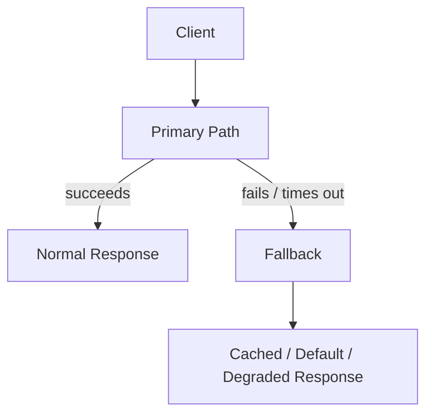

## Diagram

## Summary

Provides an alternative response when the primary path fails — returning cached data, a default value, or a reduced-functionality result rather than propagating an error. A fallback is the explicit answer to "what should the system do when this dependency is unavailable?" It is not error suppression; it is a deliberate degradation contract.

## When To Use

- A partial response or default value is more useful to the caller than an error
- Cached or stale data is acceptable when fresh data is unavailable
- The system must maintain a usable state even when non-critical dependencies fail

## When To Avoid

- The operation has no meaningful fallback — a hard error is more honest than a misleading default
- The fallback response would be used silently without signaling degraded state to the caller or operator
- Critical data consistency is required — stale or default data would cause incorrect decisions

## Pros and Cons

* Good, because user experience is preserved at reduced quality rather than failing completely
* Good, because the fallback contract makes degraded behavior explicit and testable
* Bad, because returning stale or default data silently can mask problems if not paired with observability
* Bad, because every fallback path must be maintained and tested as independently as the primary path

## Evolutions

- **From:** Error propagation as the only failure response
- **To:** Pair with Circuit Breaker (trigger the fallback when the circuit opens) and Observability (track fallback activation rate as a degradation signal)
