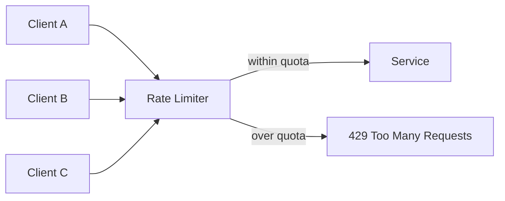

## Diagram

## Summary

Enforces an upper bound on the rate of requests a client or workload class may make within a time window. Common algorithms include token bucket (callers consume tokens that replenish at a fixed rate) and leaky bucket (requests queue and drain at a fixed rate). Rate limiting protects service capacity, enforces fairness between callers, and prevents a single client from starving others.

## When To Use

- A service must remain available under any client behavior, including misbehaving or runaway callers
- Different clients have different quotas (paid tiers, trusted vs. external callers)
- An upstream dependency has its own rate limit that must be respected

## When To Avoid

- Internal calls between services in a controlled environment where abuse is not a concern
- Systems where rejecting requests is worse than degraded throughput (consider shedding or queuing instead)

## Pros and Cons

* Good, because service capacity is protected regardless of individual client behavior
* Good, because fairness between callers is enforced structurally rather than relying on client cooperation
* Bad, because rejected requests must be handled gracefully — callers need retry logic with backoff
* Bad, because global rate limits require distributed state (e.g., a shared counter) which introduces coordination overhead

## Evolutions

- **From:** No capacity protection (service accepts all requests until it fails)
- **To:** Apply at the API Gateway for external traffic; combine with Bulkhead to isolate internal workload classes
