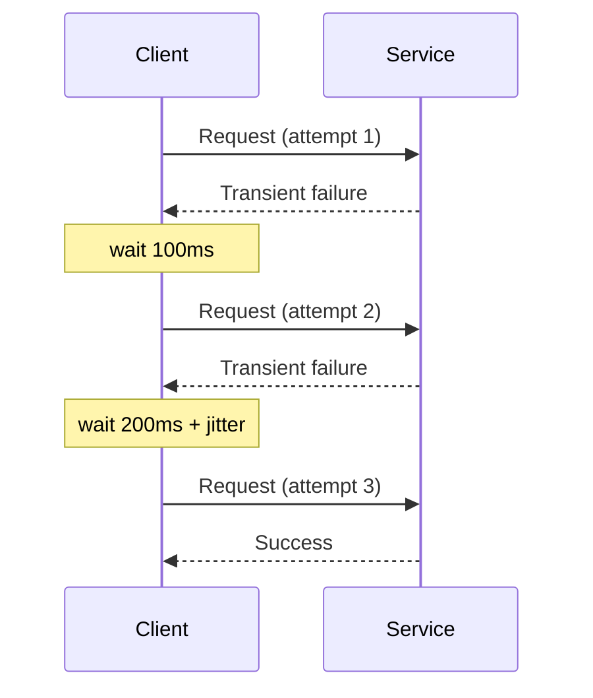

## Diagram

## Summary

Automatically re-attempts a failed request after a delay, on the assumption that the failure is transient. Effective retries use exponential backoff (each attempt waits longer than the last) and jitter (randomized delay to prevent synchronized retry storms across many callers). Retries are only safe for idempotent operations.

## When To Use

- Failures are expected to be transient (network blip, brief overload, momentary unavailability)
- The operation is idempotent — retrying a successful-but-unacknowledged request produces the same result
- A short delay between attempts is acceptable to the caller

## When To Avoid

- The operation is not idempotent (e.g., creating an order, charging a card) without idempotency keys
- The failure is deterministic — retrying a 400 Bad Request wastes resources
- The downstream is known to be fully down — use Circuit Breaker instead to stop retrying early

## Pros and Cons

* Good, because transient failures resolve transparently without surfacing errors to the caller
* Good, because exponential backoff with jitter prevents synchronized retry storms
* Bad, because retries amplify load on a struggling downstream — must be paired with Circuit Breaker
* Bad, because non-idempotent operations require explicit idempotency keys to be retried safely

## Evolutions

- **From:** Single-attempt calls with no error recovery
- **To:** Pair with Circuit Breaker (stop retrying when the downstream is persistently failing) and Timeout (bound the maximum time any attempt can take)
