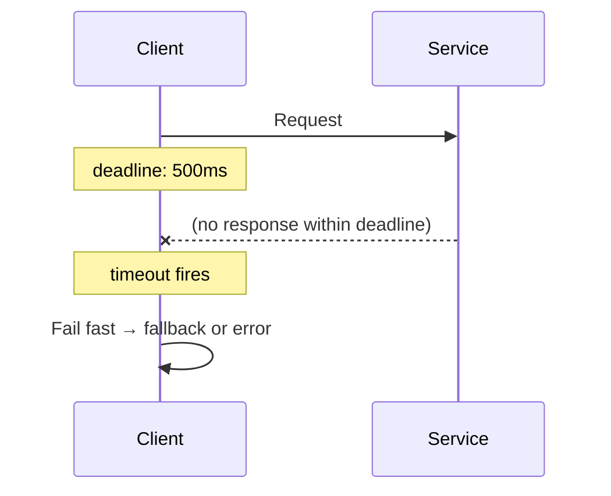

## Diagram

## Summary

Places an upper bound on how long a call to a downstream component is allowed to take. When the deadline passes without a response, the call is abandoned and an error or fallback is returned immediately. Timeouts prevent slow dependencies from holding resources (threads, connections, memory) indefinitely, which would otherwise cause cascading resource exhaustion.

## When To Use

- Any call that crosses a process or network boundary
- The caller has an acceptable upper bound on response time
- Holding a connection or thread indefinitely would exhaust the caller's resource pool

## When To Avoid

- Long-running background jobs where indefinite waiting is intentional (use a progress/heartbeat check instead)
- Operations where a partial or abandoned result causes more damage than waiting (e.g., mid-transaction writes — close the connection instead)

## Pros and Cons

* Good, because resources (threads, connections) are released predictably rather than held indefinitely
* Good, because callers cannot be held hostage by a single slow dependency
* Bad, because a timeout that fires does not cancel the downstream work — side effects may still complete
* Bad, because timeout values require calibration per dependency — too tight causes false failures, too loose defeats the purpose

## Evolutions

- **From:** Calls with no deadline (unlimited wait)
- **To:** Pair with Circuit Breaker (open the circuit when timeouts are frequent) and Fallback (return a degraded response when a timeout fires)
