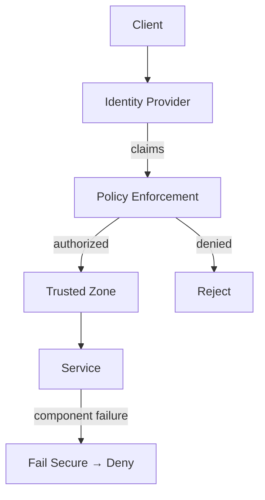

## Diagram

## Summary

A family of architectural patterns for structuring how trust is established, how authorization is enforced, and how systems behave when security controls fail. These patterns are technology-agnostic: they define structural relationships between components — not specific protocols or tooling choices.

## When To Use

- The system processes requests from untrusted or partially trusted sources
- Access to resources must be controlled and auditable
- Security must hold even when individual components malfunction

## When To Avoid

- Fully isolated systems with no external access and no sensitive data
- Prototyping stages where security structure would impede rapid iteration (add before production)

## Pros and Cons

* Good, because trust boundaries are explicit and can be reasoned about independently of implementation
* Good, because failures in security controls default to safe behavior rather than open access
* Bad, because layered security adds latency and operational complexity at every enforcement point
* Bad, because overly strict boundaries can impede legitimate access if policies are poorly calibrated

## Evolutions

- **From:** Any topology that handles external requests or multi-tenant data
- **To:** Apply Zero Trust and Security Zones as the structural foundation; layer Claims-Based Identity for portable authorization; add Sandboxing where untrusted code executes
- **Authentication:** Establish who or what is calling — Federated Identity for users, Service Identity (mTLS) for workloads, Gateway Authentication to centralize verification at the edge, and Valet Key for scoped delegated access
