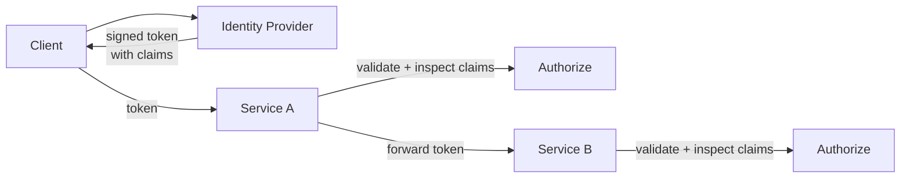

## Diagram

## Summary

Represents a caller's identity as a set of signed, portable claims — assertions about who the caller is and what they are allowed to do — issued by a trusted identity provider. Services validate the token and make authorization decisions based on its claims without calling back to the identity provider. This decouples identity verification from authorization and allows identity to propagate across service boundaries without a central session store.

## When To Use

- Identity must be verifiable across multiple services without a centralized session lookup on every request
- Authorization decisions should be made locally at each service based on claim values
- The system spans multiple domains or organizations that share a trusted identity provider

## When To Avoid

- Claims cannot be revoked quickly — tokens are valid until expiry, so short expiry or a revocation list is needed for sensitive contexts
- The identity provider is unavailable and cached tokens are not acceptable (use Fail Secure)

## Pros and Cons

* Good, because identity propagates across service boundaries without a shared session store
* Good, because services make authorization decisions locally from token claims — no synchronous identity service call per request
* Bad, because tokens are valid until expiry — immediate revocation requires short TTLs or an out-of-band revocation mechanism
* Bad, because token signing keys must be rotated and distributed — key management is a new operational concern

## Evolutions

- **From:** Session-based identity with a central session store that all services query
- **To:** Combine with Zero Trust (claims provide the per-request identity context for policy decisions) and API Gateway (validate and enrich tokens at the ingress boundary)
